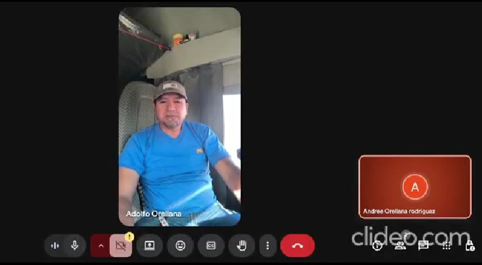
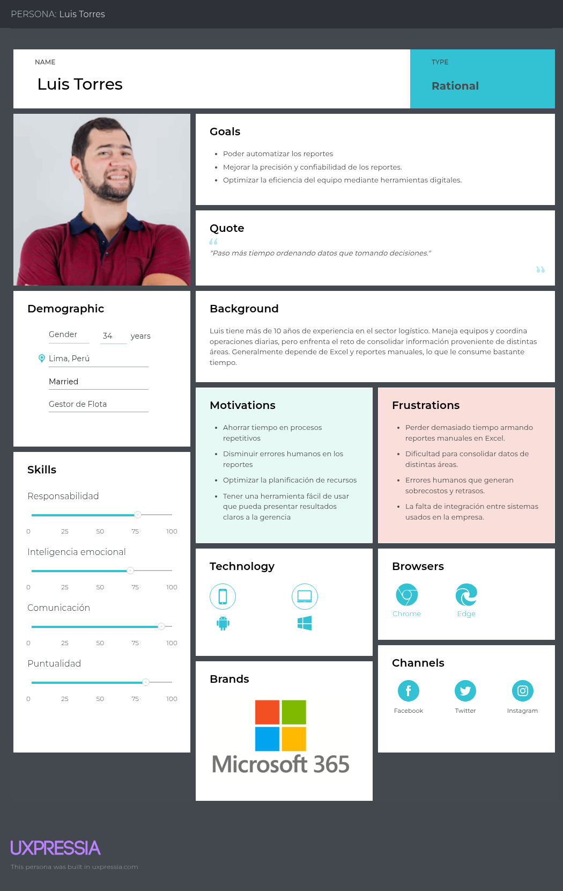
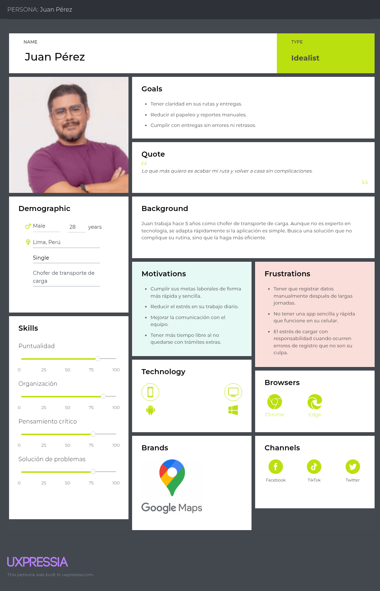
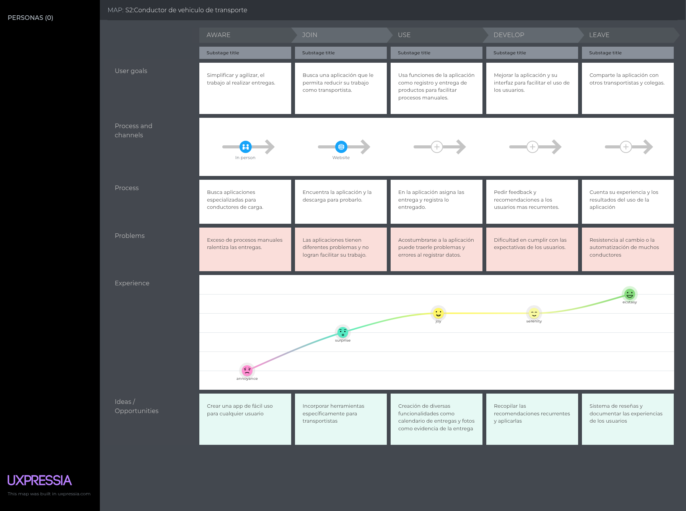
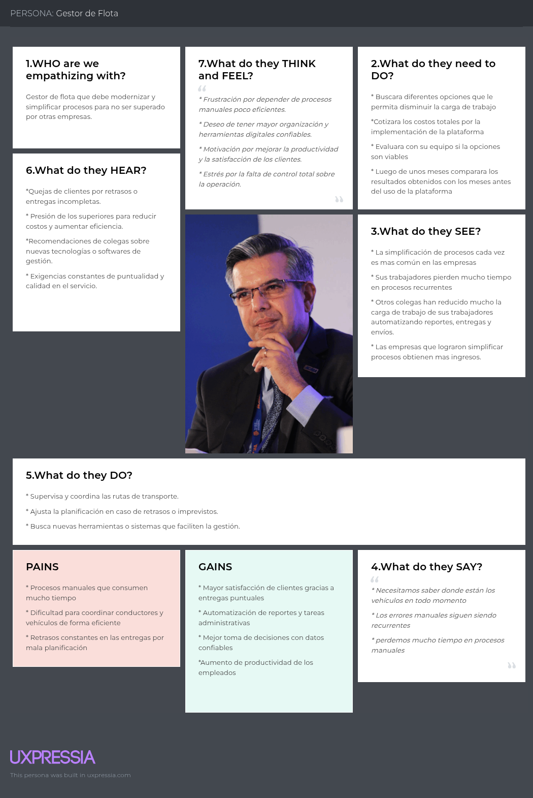
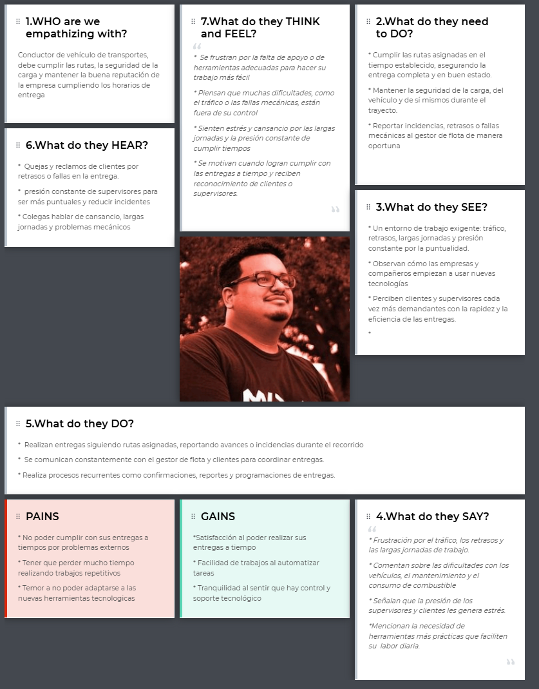
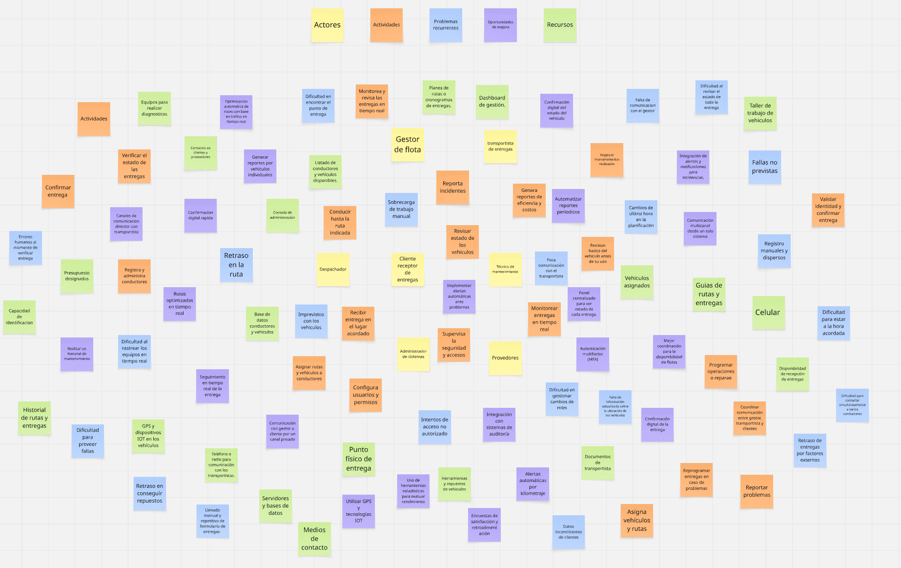
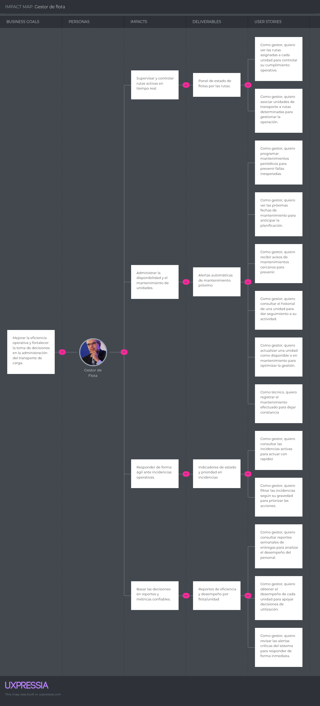
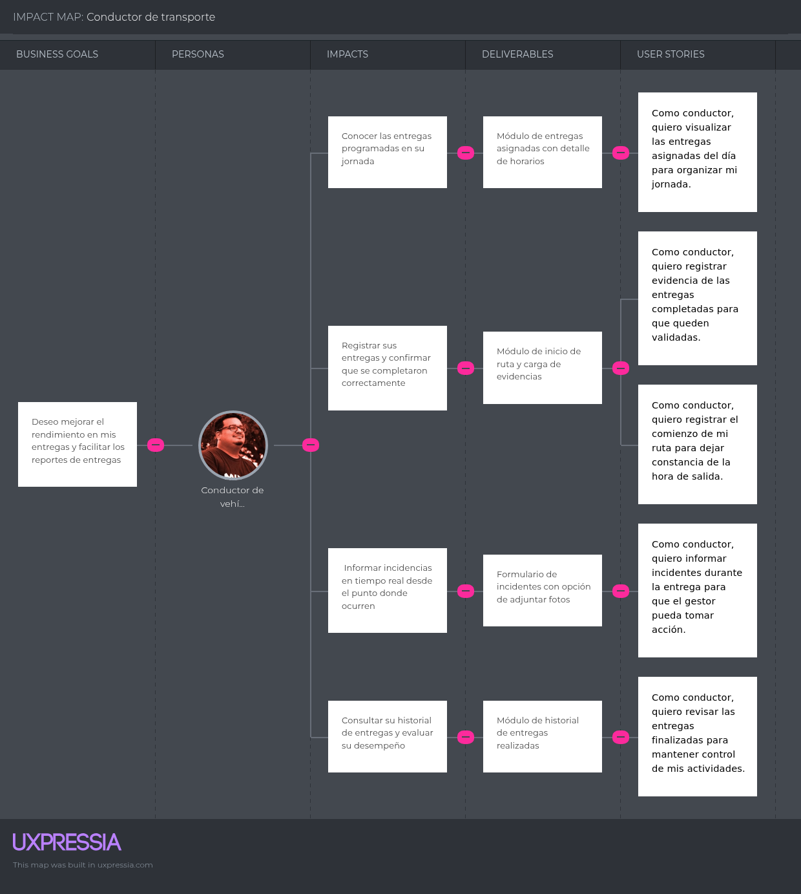

# Informe del Trabajo Final

## Universidad Peruana de Ciencias Aplicadas
### Ingeniería de Software 💻
### Séptimo Ciclo
### Curso: Aplicaciones Web (1ASI0730)
### NRC: 7461
### Docente: Ángel Augusto Velásquez Núñez
### Startup: SmartCoders
### Producto: MoveSys

* Integrantes

    * Bryan Felix Martinez Ramos 202316246
    * Merly Salon Puerta U20201b772
    * Gabriel Ferran Espinar Martínez U202310436
    * Angel Guillermo Berrospi Marin U202114701
    * Orellana Rodriguez Mel Andree U202116018

### Septiembre 2025

# **Registro de Versiones del Informe**

| Versión | Fecha | Autor | Descripción de modificación |
|-----------|-----------|-----------|-----------|
|-----------|-----------|-----------|-----------|
|-----------|-----------|-----------|-----------|

# **Project Report Collaboration Insights**

URL Project Report (Github): [https://github.com/1ASI0730-2510-4370-G2-Youper/Report](https://github.com/1ASI0730-2510-4370-G2-Youper/Report)

## Contenido

- [✨ Informe Trabajo Final ✨](#-informe-trabajo-final-)
    - [Universidad Peruana de Ciencias Aplicadas 🎓](#universidad-peruana-de-ciencias-aplicadas-)
    - [Registro de versiones del Informe](#registro-de-versiones-del-informe)
    - [Project Report Collaboration Insights](#project-report-collaboration-insights)
    - [Contenido](#contenido)
    - [Student Outcome](#student-outcome)
- [Capítulo I: Introducción](#capítulo-i-introducción)
    - [1.1. Startup Profile](#11-startup-profile)
    - [1.1.1. Descripción de la Startup](#111-descripción-de-la-startup)
    - [1.1.2 Perfiles de integrantes del equipo](#112-perfiles-de-integrantes-del-equipo)
    - [1.2. Solution Profile](#12-solution-profile)
    - [1.2.1 Antecedentes y problemática](#121-antecedentes-y-problemática)
    - [1.2.2 Lean Ux Process](#122-lean-ux-process)
    - [1.2.2.1. Lean UX Problem Statements](#1221-lean-ux-problem-statements)
    - [1.2.2.2. Lean UX Assumptions](#1222-lean-ux-assumptions)
    - [1.2.2.3. Lean UX Hypothesis Statements](#1223-lean-ux-hypothesis-statements)
    - [1.2.2.4. Lean UX Canvas](#1224-lean-ux-canvas)
    - [Segmentos Objetivos](#segmentos-objetivos)
- [Capítulo II: Requeriments Elicitation \& Analysis](#capítulo-ii-requeriments-elicitation--analysis)
    - [2.1. Competidores](#21-competidores)
    - [2.1.1. Análisis competitivo](#211-análisis-competitivo)
    - [2.1.2. Estrategias y tácticas frente a competidores](#212-estrategias-y-tácticas-frente-a-competidores)
    - [2.2. Entrevistas 📝](#22-entrevistas-)
    - [2.2.1. Diseño de entrevistas](#221-diseño-de-entrevistas)
    - [2.2.2. Registro de entrevistas](#222-registro-de-entrevistas)
    - [2.2.3. Análisis de entrevistas](#223-análisis-de-entrevistas)
    - [2.3. Needfinding](#23-needfinding)
    - [2.3.1. User Personas](#231-user-personas)
    - [2.3.2. User Task Matrix](#232-user-task-matrix)
    - [2.3.3. User Journey Mapping](#233-user-journey-mapping)
    - [2.3.4. Empathy Mapping](#234-empathy-mapping)
    - [2.4. Big Picture EventStorming](#24-big-picture-evenstorming)
    - [2.5. Ubiquitous Language](#25-ubiquitous-language)
- [Capítulo III: Requeriments Specification](#capítulo-iii-requeriments-specification)
    - [3.1. User Stories](#31-user-stories)
    - [3.2. Impact Mapping](#32-impact-mapping)
    - [3.3. Product Backlog](#33-product-backlog)
- [Capítulo IV: Product Desing](#capítulo-iv-product-desing)
    - [4.1. Style Guidelines](#41-style-guidelines)
    - [4.1.1. General Style Guidelines](#411-general-style-guidelines)
    - [4.1.2. Web Style Guidelines](#412-web-style-guidelines)
    - [4.2. Information Architecture](#42-information-architecture)
    - [4.2.1. Organization Systems](#421-organization-systems)
    - [4.2.2. Labeling Systems](#422-labeling-systems)
    - [4.2.3. SEO Tags and Meta Tags](#423-seo-tags-and-meta-tags)
    - [4.2.4. Searching Systems](#424-searching-systems)
    - [4.2.5. Navigation Systems](#425-navigation-systems)
    - [4.3. Landing Page UI Desing](#43-landing-page-ui-desing)
    - [4.3.1. Landing Page Wireframes](#431-landing-page-wireframes)
    - [4.3.2. Landing Page Mock-Up](#432-landing-page-mock-up)
    - [4.4. Web Applications UX/UI Desing](#44-web-applications-uxui-desing)
    - [4.4.1. Web Applications Wireframes](#441-web-applications-wireframes)
    - [4.4.2. Web Applications Wireflow Diagrams](#442-web-applications-wireflow-diagrams)
    -[4.4.3. Web Applications Mock-ups](#443-web-applications-mock-ups-diagrams)
    - [4.4.4. Web Applications User Flow Diagrams](#444-web-applications-user-flow-diagrams)
    - [4.5. Web Applications Prototyping](#45-web-applications-prototyping)
    - [4.6.1. Design-Level EventStorming](#461-design-level-eventstorming)
    - [4.6.2. Software Architecture Context Diagram](#462-software-architecture-context-diagram)
    - [4.6.3. Software Architecture Container Diagram](#463-software-architecture-container-diagram)
    - [4.6.4. Software Architecture Components Diagram](#464-software-architecture-components-diagram)
    - [4.7. Software Object-Oriented Desing](#47-software-object-oriented-desing)
    - [4.7.1. Class Diagram](#471-class-diagram)
    - [4.8. Database Desing](#48-database-desing)
    - [4.8.1. Database Diagrams](#481-database-diagrams)
- [Capítulo V: Product Implementation, Validation \& Deployment](#capítulo-v-product-implementation-validation--deployment)
    - [5.1. Software Configuration Management](#51-software-configuration-management)
    - [5.1.1. Software Development Environment Configuration](#511-software-development-environment-configuration)
    - [5.1.2. Source Code Management](#512-source-code-management)
    - [5.1.3. Source Code Style Guide \& Conventions](#513-source-code-style-guide--conventions)
    - [5.1.4. Software Deployment Configuration](#514-software-deployment-configuration)
    - [5.2. Landing Page, Service \& Applications Implementation](#52-landing-page-service--applications-implementation)
    - [5.2.1. Sprint](#52x-sprint)
    -  [5.2.1.1. Sprint Planning 1](#5211-Sprint-Planning1)
    -  [5.2.1.2. Aspect Leaders and Collaborators](#5212-Aspect-Leaders-and-Collaborators)
    -  [5.2.1.3. Sprint Backlog 1](#5213-Sprint-Backlog-1)
    -  [5.2.1.4. Development Evidence for Sprint Review](#5214-Development-Evidence-for-Sprint-Review)
    -  [5.2.1.5. Execution Evidence for Sprint Review](#5215-Execution-Evidence-for-Sprint-Review)
    -  [5.2.1.6. Services Documentation Evidence for Sprint Review](#5216-Services-Documentation-Evidence-for-Sprint-Review)
    -  [5.2.1.7. Software Deployment Evidence for Sprint Review](#5217-Software-Deployment-Evidence-for-Sprint-Review)
    -  [5.2.1.8. Team Collaboration Insights during Sprint](#5218-Team-Collaboration-Insights-during-Sprint)
    -  [Conclusiones](#Conclusiones)
    -  [Bibliografía](#Bibliografía)
    -  [Anexos](#Anexos)

# **Student Outcome**

**ABET – EAC - Student Outcome 5**
Criterio: La capacidad de funcionar efectivamente en un equipo cuyos miembros juntos proporcionan liderazgo, crean un entorno de colaboración e inclusivo, establecen objetivos, planifican tareas y cumplen objetivos. 
En el siguiente cuadro se describe las acciones realizadas y enunciados de conclusiones por parte del grupo, que permiten sustentar el haber alcanzado el logro del ABET – EAC - Student Outcome 5. 

| Criterio específico | Acciones realizadas | Conclusiones |
| ------------------- | ------------------- | ------------ |
| ------------------- | ------------------- | ------------ |
| ------------------- | ------------------- | ------------ |

# Capítulo 1: Introducción

## 1.1. Startup Profile

 El perfil de una startup constituye un elemento esencial para definir su identidad y trazar el rumbo de la empresa naciente. Este apartado no solo expone sus aspiraciones y los valores que guían sus acciones, sino que también muestra su propuesta diferencial y la manera en que se posiciona frente a la competencia.
 En este espacio se presentan los aspectos clave que configuran la esencia de la startup, como su origen, las motivaciones que impulsaron su creación, el problema específico que busca resolver y cómo su enfoque innovador le brinda una ventaja en el mercado.
 Del mismo modo, se describen sus metas a corto, mediano y largo plazo, así como las estrategias planteadas para crecer y consolidarse en su sector. Comprender estos elementos resulta fundamental para valorar el potencial del perfil de la startup y el impacto que puede generar dentro de su entorno.

### 1.1.1. Descripción de la Startup

 MoveSys es una plataforma web innovadora creada para transformar el sector del transporte de carga, brindando una solución integral y tecnológica para la gestión de operaciones logísticas. La aplicación conecta a las empresas de transporte con herramientas inteligentes que garantizan un control detallado de cada servicio. Entre sus principales funciones se encuentran el registro automático del kilometraje, la captura de evidencia fotográfica en el momento de las entregas y la geolocalización en tiempo real. Además, la generación automática de reportes e indicadores de rendimiento facilita la toma de decisiones estratégicas, mejorando la eficiencia operativa y reduciendo costos innecesarios.

 Esta propuesta está dirigida tanto a compañías de transporte que buscan fortalecer la trazabilidad de sus procesos, como a organizaciones logísticas que requieren un control exhaustivo y ágil de sus servicios. Al digitalizar y optimizar cada etapa de la operación, MoveSys promueve mayor transparencia y calidad en la entrega de productos, lo que contribuye a consolidar la confianza del cliente final.

 Misión:
 En MoveSys, nuestra misión es revolucionar la gestión del transporte de carga mediante soluciones tecnológicas inteligentes, que permitan a nuestros clientes operar con mayor eficiencia, optimizar costos y mejorar la trazabilidad de sus operaciones.

 Visión:
 Buscamos consolidarnos como referentes en innovación logística, impulsando un futuro donde el transporte de carga sea más transparente, eficiente y sostenible, con proyección de crecimiento a nivel nacional e internacional.

### 1.1.2. Perfiles de integrantes del equipo

| **Integrante**            | **Angel Guillermo** |
|---------------------------|---------------------------------------------------------------------------------------------------|
| **Código del Estudiante** |      U202114701              |
| **Carrera**               | Ingeniería de Software             |
| **Descripción**           | Soy estudiante de Ingeniería de Software. Tendre el compromiso con mi equipo. Cuento con conocimientos en html, css, javascript y SQL, lo cual puede ser de ayuda en el desarrollo del proyecto  |
| Foto                      |  |

| **Integrante**            | **Mel Andre Orellana**                                             |
|---------------------------|---------------------------------------------------------------------------------------------------|
| **Código del Estudiante** | U202116018                         |
| **Carrera**               | Ingeniería de   Software           |
| **Descripción**           |     Soy estudiante de Ingeniería de Software y me caracterizo por mi compromiso con el trabajo en equipo.Cuento con conocimientos en HTML, CSS, JavaScript y SQL, lo cual puede aportar al desarrollo del proyecto en las áreas de frontend y bases de datos. Además, tengo experiencia en Python, lo que me permite apoyar en tareas de programación, automatización y análisis cuando sea necesario.   |
| Foto                      |     |

| **Integrante**            | **Gabriel Ferran Espinar Martínez**                                             |
|---------------------------|---------------------------------------------------------------------------------------------------|
| **Código del Estudiante** | U202310436                                   |
| **Carrera**               | Ingeniería de Software                                                                   |
| **Descripción**           |  Soy estudiante de la carrera de Ingeniería de Software, Me considero una persona trabajadora. Me interesa aprender constantemente en especial en áreas relacionadas a la tecnología y cuento con conocimientos en HTML, CSS, Javascript y SQL, lo cual puede servir en el desarrollo del proyecto.       |
| Foto                      |        |

| **Integrante**            | **Martinez Bryan**                                             |
|---------------------------|---------------------------------------------------------------------------------------------------|
| **Código del Estudiante** | u202316246                                   |
| **Carrera**               | Ingeniería de Software                                                                     |
| **Descripción**           | Soy estudiante de la carrera de ingeniería de software de la universidad Peruana de ciencias aplicadas, soy una persona comprometida y responsable, priorizo mucho mis responsabilidades y siempre trato de cumplir mis trabajos en los tiempos establecidos.       |
| Foto                      |
 
   |

| **Integrante**            | **Merly Salon Puerta**  |
|---------------------------|---------------------------------------------------------------------------------------------------|
| **Código del Estudiante** | u20201b772                       |
| **Carrera**               | Ingeniería de Software                     |
| **Descripción**           | Soy estudiante de Ingeniería de Software. Estoy dispuesta a trabajar con mie quipo esforzadamente. Cuento con conocimientos en html, css y java script, lo cual puede sumar en el desarrollo del proyecto                                |
| Foto                      |                               |

## 1.2. Solution Profile
    
### 1.2.1 Antecedentes y problemática

 | Elemento        | Descripción                                                                                                                                                              |
 |-----------------|--------------------------------------------------------------------------------------------------------------------------------------------------------------------------|
 | **Who (Quién)** | Empresas de transporte de carga, operadores logísticos, despachadores y choferes que necesitan controlar, supervisar y reportar sus operaciones de manera precisa y eficiente. |
 | **What (Qué)**  | Plataforma web que digitaliza y automatiza la gestión logística del transporte de carga, incluyendo planificación de servicios, registro de kilometraje, consumo de combustible, evidencia fotográfica, geolocalización y generación de reportes. |
 | **Where (Dónde)** | En oficinas de operación logística, empresas de transporte, y en campo a través de dispositivos móviles utilizados por los choferes. |
 | **When (Cuándo)** |Durante todas las etapas del proceso logístico: planificación previa, ejecución del servicio y post-servicio (análisis e informes). |
 | **Why (Por qué)** |Actualmente, muchas empresas gestionan sus operaciones en papel o Excel, lo cual implica errores, pérdida de información, falta de trazabilidad y un uso ineficiente de los recursos. Esto limita la capacidad de tomar decisiones basadas en datos en tiempo real y reduce la confianza del cliente.|
 | **How (Cómo)** |A través de una plataforma digital que permite crear servicios, registrar recorridos y consumos en tiempo real, visualizar la ubicación GPS de los vehículos, y generar reportes automáticos con métricas clave para mejorar el desempeño operativo. |
 | **How Much (Cuánto)** | El acceso a la plataforma se brinda mediante planes de suscripción    mensual, dependiendo del número de usuarios, vehículos y funcionalidades activadas por empresa. |

### 1.2.2 Lean UX Process.

### 1.2.2.1. Lean UX Problem Statements.

 MoveSys es una plataforma diseñada para digitalizar de manera integral la gestión del transporte de carga, sustituyendo procesos manuales y aumentando la eficiencia operativa. Hoy en día, muchas empresas continúan utilizando formularios físicos, reportes en papel y hojas de cálculo, lo que ocasiona demoras, errores humanos y una baja trazabilidad en sus operaciones.

 El principal reto consiste en lograr que las compañías adopten esta solución digital como una herramienta segura, fácil de usar y transformadora. Si bien la propuesta tecnológica ofrece una mejora considerable, algunas organizaciones pueden mostrar resistencia al cambio por temor a la complejidad o por su arraigo a métodos tradicionales.

 La gran pregunta es: ¿Cómo podemos impulsar la adopción de MoveSys como una solución confiable, sencilla y eficaz que facilite la transformación digital en la gestión del transporte de carga y optimice los procesos logísticos?

### 1.2.2.2. Lean UX Assumptions.

Contexto: Muchas organizaciones aún dependen de procesos manuales o del uso de Excel para controlar sus operaciones logísticas, lo que limita la eficiencia y dificulta la gestión.
Assumption: Implementar una plataforma centralizada que digitalice cada etapa del proceso reducirá errores, optimizará tiempos y potenciará la productividad operativa.

Contexto: La ausencia de trazabilidad en tiempo real genera poca confianza en los clientes y complica el monitoreo adecuado de las entregas.
Assumption: Incorporar geolocalización en tiempo real y registro fotográfico durante las entregas incrementará la transparencia, reforzará la confianza del cliente y mejorará la calidad del servicio.

Contexto: Los reportes elaborados manualmente consumen tiempo y recursos, lo que retrasa la obtención de información clave para la toma de decisiones.
Assumption: Automatizar la creación de reportes con indicadores estratégicos permitirá a los gestores decidir con mayor rapidez y basarse en datos precisos.

Contexto: La introducción de nuevas tecnologías suele encontrar resistencia en empresas habituadas a prácticas tradicionales.
Assumption: Ofrecer una interfaz intuitiva, junto con capacitación y soporte continuo, facilitará la transición hacia lo digital y aumentará la adopción de la plataforma.

Contexto: Los equipos de transporte y logística manejan distintos niveles de acceso y responsabilidad sobre la información.
Assumption: Definir roles personalizados dentro de la plataforma garantizará una gestión más segura, ordenada y eficiente de datos y procesos.

### 1.2.2.3. Lean UX Hypothesis Statements.

 - Confiamos en que al proporcionar una plataforma digital unificada que concentre todas las operaciones logísticas, lograremos mayor eficiencia y trazabilidad en el transporte de carga.
 Validaremos esta hipótesis cuando identifiquemos menos errores en la operación y mejoras notables en los tiempos de entrega y gestión.

 - Confiamos en que al integrar geolocalización en tiempo real y evidencia fotográfica en las entregas, fortaleceremos la confianza del cliente final y aumentaremos la transparencia del servicio.
 Sabremos que estamos en lo correcto cuando se reduzcan los reclamos y la satisfacción de los clientes muestre un incremento.

 - Confiamos en que al digitalizar y automatizar los reportes con métricas clave, impulsaremos una toma de decisiones más ágil y fundamentada en datos.
 Nuestra hipótesis se confirmará cuando los gestores puedan reaccionar más rápido y reporten mejoras en sus indicadores logísticos.

 - Confiamos en que al ofrecer una interfaz intuitiva acompañada de capacitación, facilitaremos la adopción de la plataforma incluso en equipos con baja experiencia tecnológica.
 Lo confirmaremos cuando observemos una disminución en los requerimientos de soporte técnico y un uso constante de la herramienta.

 - Confiamos en que al implementar la gestión de roles y permisos diferenciados, aumentaremos la seguridad y la eficiencia interna de las operaciones.
 Estaremos en lo cierto cuando no se registren manipulaciones indebidas de datos y los usuarios valoren la organización y control del sistema.

### 1.2.2.4. Lean UX Canvas.

## 1.3. Segmentos objetivo.

# Capítulo II: Requirements Elicitation & Analysis
    
## 2.1. Competidores.

#### Drivin
Drivin es un software TMS con presencia en Perú y Latinoamérica. Está orientado a la optimización de rutas,
seguimiento en tiempo real y generación de indicadores logísticos. Se diferencia por su capacidad de ofrecer 
visibilidad completa y control de operaciones para empresas con alto volumen de entregas.
 
Su propuesta de valor está orientada a empresas que buscan eficiencia en la última milla y trazabilidad de sus operaciones.

#### Shipday
Shipday es un software de gestión de entregas y courier basado en la nube. Está orientado a empresas de delivery,
paquetería y logística de última milla que buscan digitalizar sus operaciones. Ofrece aplicaciones móviles para conductores,
seguimiento en tiempo real de pedidos y notificaciones automáticas a los clientes.
 
Su propuesta de valor se centra en mejorar la experiencia de entrega y ofrecer visibilidad completa tanto a empresas como a usuarios finales.

#### Avanzza Software
Avanzza es una plataforma enfocada en la gestión de pedidos, rutas y flotas.
Ofrece seguimiento en tiempo real con evidencias digitales de entrega (fotos, firmas), 
notificaciones y comunicación directa con clientes.
 
Su propuesta de valor se centra en la visibilidad al cliente final y en la trazabilidad de las operaciones de distribución,
permitiendo controlar las etapas de entrega, obtener comunicación total con la flota y solucionar cualquier contratiempo de inmediato.

    
### 2.1.1. Análisis competitivo.

<table>
    <tr>
        <td colspan="6" class="section-title">
            <h3>Competitive Analysis Landscape</h3>
        </td>
    </tr>
    <tr>
        <td colspan="2" rowspan="2">
            ¿Por qué llevar a cabo este análisis?
        </td>
        <td colspan="4">
            Escriba en el recuadro la pregunta que busca responder o el objetivo de este análisis.
        </td>
    </tr>
    <tr>
        <td colspan="4">
            Analizar cómo se posiciona MoveSys frente a sus competidores en Perú en términos de características, 
            propuesta de valor y estrategias de mercado.
        </td>
    </tr>
    <tr>
        <td colspan="2">(Productos)</td>
<td align="center">MoveSys
    

    

</td>
<td align="center">Drivin
    

    

</td>
<td align="center">Shipday
    

    

</td>
<td align="center">Avanzza Software
    

    

</td>
    </tr>
    <tr>
       <td align="center" rowspan="2">Perfil</td>
        <td>Overview</td>
        <td rowspan="1">MoveSys es un sistema de gestión logística orientado a transporte de carga. Permite registrar y consultar entregas, supervisar unidades, programar mantenimientos y acceder a indicadores clave a través de reportes automáticos. Cuenta con API RESTful para integraciones externas.</td>
        <td rowspan="1">Drivin es un TMS que optimiza rutas y entregas con visibilidad en tiempo real, usado en Perú y LATAM.</td>
        <td rowspan="1">Shipday es un software de gestión de entregas y courier, enfocado en última milla, con seguimiento en tiempo real y notificaciones al cliente.</td>
        <td rowspan="1">Avanzza gestiona pedidos, flotas y rutas con evidencias digitales y seguimiento en tiempo real.</td>
    </tr>
    <tr>
        <td>Ventaja Competitiva ¿Qué valor ofreces a los clientes?</td>
        <td rowspan="1">Automatización de rutas y entregas, control de flota, indicadores de desempeño, gestión de incidencias y mantenimientos, sitio web informativo y API RESTful para integraciones.</td>
        <td rowspan="1">Optimización de rutas y KPIs logísticos avanzados.</td>
        <td rowspan="1">Aplicaciones móviles para conductores, integración con plataformas de e-commerce y experiencia fluida para el cliente final.</td>
        <td rowspan="1">Visibilidad al cliente final y trazabilidad de entregas con evidencias digitales.</td>
    </tr>
    <tr>
       <td align="center" rowspan="2">Perfil de Marketing</td>
        <td>Mercado Objetivo</td>
        <td rowspan="1">Empresas medianas y grandes de transporte de carga, operadores logísticos y flotas que necesitan control integral de operaciones, mantenimientos e indicadores.</td>
        <td rowspan="1">Retail, distribución y empresas con alto volumen de entregas.</td>
        <td rowspan="1">Empresas de delivery, courier y última milla que buscan digitalizar operaciones.</td>
        <td rowspan="1">Pymes y medianas empresas con entregas frecuentes.</td>
    </tr>
    <tr>
        <td colspan="1">Estrategias de Marketing</td>
        <td rowspan="1">Enfoque en diferenciación por eficiencia de flota y costos (combustible/mantenimiento), soporte local en Perú, integraciones IoT, API y demostraciones personalizadas.</td>
        <td rowspan="1">Prueba gratuita/demos, casos de éxito en LATAM, marketing orientado a optimización de rutas y métricas de desempeño.</td>
        <td rowspan="1">Marketing digital global, integraciones rápidas con e-commerce (Shopify, WooCommerce), onboarding ágil y foco en última milla.</td>
        <td rowspan="1">Casos de éxito, comunicación al cliente final, foco en evidencias de entrega y tiempos de servicio.</td>
    </tr>
    <tr>
       <td align="center" rowspan="3">Productos & Servicios</td>
        <td>Productos & Servicios</td>
        <td rowspan="1">Plataforma web/móvil para registro y seguimiento de entregas, monitoreo de flota, planificación de rutas, control de combustible, gestión de incidencias y mantenimientos, reportes de indicadores y API RESTful.</td>
        <td rowspan="1">Optimización de rutas, seguimiento en tiempo real, control de vehículos y tableros de KPIs logísticos.</td>
        <td rowspan="1">Gestión de entregas/courier, apps móviles de repartidor, tracking en tiempo real, notificaciones automáticas y portal del cliente.</td>
        <td rowspan="1">Gestión de pedidos, rutas y flota con evidencias digitales (fotos/firmas), seguimiento en tiempo real y comunicación con clientes.</td>
    </tr>
    <tr>
        <td colspan="1">Precios & Costos</td>
        <td rowspan="1">Planes desde $500 a $800/mes según módulos y tamaño de flota.</td>
        <td rowspan="1">Planes escalables por volumen/empresa (incluye paquetes PYME; tarifas según alcance).</td>
        <td rowspan="1">Desde ~$29/mes en planes básicos hasta niveles avanzados para operaciones grandes.</td>
        <td rowspan="1">Esquemas ajustados a número de usuarios/flota; tarifas según alcance del proyecto.</td>
    </tr>
    <tr>
        <td colspan="1">Canales de Distribución (Web y/o Móvil)</td>
        <td rowspan="1">Web y aplicaciones móviles (iOS/Android), integraciones GPS/IoT y API.</td>
        <td rowspan="1">Web y móvil, integraciones con GPS/mapas y sistemas afines.</td>
        <td rowspan="1">Web, apps móviles (iOS/Android) y APIs para integraciones con e-commerce.</td>
        <td rowspan="1">Web y móvil con módulos de evidencia y comunicación al cliente.</td>
    </tr>
    <tr>
       <td align="center" rowspan="4">Análisis SWOT</td>
        <td>Fortalezas</td>
        <td rowspan="1">Cobertura integral de logística de carga: flota, rutas, incidencias, mantenimientos, indicadores y API; enfoque en reducción de costos.</td>
        <td rowspan="1">Reconocimiento en LATAM, sólidas métricas y optimización de rutas.</td>
        <td rowspan="1">Experiencia de última milla pulida, apps móviles robustas e integraciones rápidas.</td>
        <td rowspan="1">Visibilidad al cliente final y trazabilidad con evidencias digitales.</td>
    </tr>
    <tr>
        <td colspan="1">Debilidades</td>
        <td rowspan="1">Startup en crecimiento con menor reconocimiento de marca internacional; requiere casos de éxito locales adicionales.</td>
        <td rowspan="1">Puede resultar costoso para pymes pequeñas; curva de adopción en operaciones complejas.</td>
        <td rowspan="1">Enfoque en última milla; menos profundidad en gestión de transporte pesado/administrativa.</td>
        <td rowspan="1">Cobertura limitada en módulos administrativos/financieros avanzados.</td>
    </tr>
    <tr>
        <td colspan="1">Oportunidades</td>
        <td rowspan="1">Digitalización logística en Perú, alianzas con operadores y aseguradoras, analítica predictiva (combustible/mantenimiento) e IoT.</td>
        <td rowspan="1">Expansión en sectores con alto volumen de entregas y acuerdos regionales.</td>
        <td rowspan="1">Crecimiento de delivery/e-commerce en LATAM; verticales B2B2C.</td>
        <td rowspan="1">Ampliar integraciones y módulos de costos para pymes en expansión.</td>
    </tr>
    <tr>
        <td colspan="1">Amenazas</td>
        <td rowspan="1">Entrada de TMS internacionales con mayor capital; presión de precio en pymes.</td>
        <td rowspan="1">Competencia de ERPs logísticos más completos.</td>
        <td rowspan="1">Competidores locales de última milla con precios bajos.</td>
        <td rowspan="1">Saturación del mercado de entregas urbanas y alta rotación de repartidores.</td>
    </tr>
</table>
    
### 2.1.2. Estrategias y tácticas frente a competidores.

#### Fortalezas: Enfoque especializado en transporte de carga y gestión de flotas

MoveSys se diferencia de competidores como Drivin, Shipday y Avanzza al enfocarse en el transporte de carga y no en la última milla. Ofrece control de flota, mantenimientos preventivos, gestión de incidencias y reportes automáticos con indicadores de desempeño (KPIs), además de integración mediante API RESTful.

#### Táctica:
Destacar en campañas de marketing el valor agregado de un sistema especializado en carga pesada, resaltando funcionalidades que competidores más generalistas no ofrecen, como control de mantenimientos y KPIs logísticos avanzados.

#### Debilidades: Startup en etapa temprana con poca validación en el mercado
Al ser una solución nueva, MoveSys todavía no cuenta con la misma trayectoria, base de clientes ni alianzas estratégicas que Drivin o Shipday, lo que puede generar dudas en empresas grandes.

#### Táctica:
Impulsar pilotos gratuitos o de bajo costo con empresas de transporte locales, generando casos de éxito y testimonios. Además, buscar alianzas con gremios de transporte y operadores logísticos para ganar confianza.

#### Oportunidades: Necesidad de digitalización en transporte de carga en Perú
Muchas empresas medianas y grandes en Perú aún dependen de procesos manuales o sistemas poco integrados para gestionar su transporte de carga. Esto representa un espacio desatendido que no es prioridad para software más centrados en delivery o retail.

#### Táctica:
Enfocar los esfuerzos comerciales en este nicho, generando contenido técnico (webinars, artículos, guías) y ofreciendo integraciones fáciles con ERPs o plataformas de clientes que aún no cuentan con digitalización logística avanzada.

#### Amenazas: Competidores consolidados con más recursos
Drivin, Shipday y Avanzza ya cuentan con presencia en el mercado y capacidad para ajustar precios, lanzar nuevas funcionalidades o ampliar su cobertura si perciben a MoveSys como una amenaza directa.

#### Táctica:
Adoptar una estrategia de innovación ágil, incorporando feedback de los usuarios para mejorar la plataforma rápidamente. Además, diferenciarse ofreciendo soporte técnico local 24/7 en español, un aspecto poco atendido por competidores internacionales.
    
## 2.2. Entrevistas.
    
### 2.2.1. Diseño de entrevistas.

#### Segmento Objetivo 1: Empresas de transporte de carga

1.    ¿Cuál es su nombre, edad y rol en la empresa de transporte?
2.    ¿En qué distrito vive y donde se ubican principalmente las operaciones de su empresa?
3.    ¿Qué tipo de dispositivos utiliza más para gestionar su trabajo (PC de escritorio, laptop, tablet, smartphone)?
4.    ¿Qué sistema operativo utiliza con mayor frecuencia (Windows, macOS, Linux)?
5.    ¿Qué aplicaciones utiliza con más frecuencia en su día a día?
6.    ¿Cuál es el mayor reto que enfrenta actualmente en la gestión de su flota?
7.    ¿Cuántos vehículos administra y qué tipos de rutas realizan normalmente?
8.    ¿Actualmente cómo llevan el control de kilometraje y combustible: en papel, Excel o software? 
9.    ¿Qué problemas surgen al depender de registros manuales en sus operaciones diarias?
10.	¿Qué indicadores considera más importantes al evaluar la eficiencia de su flota?
11.	¿Qué tan complicado le resulta generar reportes de sus operaciones hoy en día? 
12.	¿Cómo afectan los errores en el registro de datos a la planificación y los costos de su empresa?
13.	¿Qué beneficios esperaría obtener de una plataforma digital como MoveSys?
14.	¿Qué nivel de capacitación considera necesario para que sus trabajadores adopten una app de este tipo?
15.	¿Cuál sería un rango de inversión razonable para implementar una solución de gestión logística como MoveSys?

#### Segmento Objetivo 2: Conductores de unidades de carga

1.    ¿Cuál es su nombre, edad y cuántos años lleva trabajando como chofer de transporte de carga?
2.    ¿En qué distrito vive y desde dónde suele iniciar sus rutas?
3.    ¿Qué tipo de dispositivo móvil usa para gestionar su trabajo (smartphone, celular básico)?
4.    ¿Qué sistema operativo tiene su celular (Android o iOS)?
5.    ¿Qué aplicaciones móviles utiliza con más frecuencia en su día a día?
6.    ¿Cuánto tiempo lleva trabajando en transporte de carga y qué tipo de rutas suele cubrir?
7.    ¿Cómo anota el kilometraje al inicio y final de un viaje? 
8.    ¿Cómo registra el consumo de combustible durante un trayecto? 
9.    ¿Qué dificultades tiene al llenar formularios o reportes manuales?
10.	¿Cuánto tiempo le toma completar el registro de datos logísticos en un día normal?
11.	¿Qué tan cómodo se sentiría usando una app en el celular para registrar sus viajes?
12.	¿Le resultaría útil que la aplicación guarde automáticamente su ubicación y genere un historial de ruta?
13.	¿Qué funciones cree indispensables para que la app sea realmente práctica en ruta?
14.	¿Qué tan fácil cree que sería para usted aprender a usar MoveSys sin ayuda externa?
15.	¿Qué incentivo lo motivaría a completar sus reportes de viaje puntualmente?

    
### 2.2.2. Registro de entrevistas.

#### Segmento objetivo #1: Compañías de transporte de carga 

---

  

**Entrevista 1:**  
- **Nombres y apellidos:** Rodrigo Gómez 
- **Edad:** 29 años
- **Distrito:** San Martín de Porres

- **Inicio:** 1:07 
- **Duración:** 7:12
- **URL:**  https://upcedupe-my.sharepoint.com/:v:/g/personal/u202114701_upc_edu_pe/Ea9HzqfEW_xKin2PIKDPPDQBnvHFCDQ2QxmlHFo18piDOg?e=15W53g&nav=eyJyZWZlcnJhbEluZm8iOnsicmVmZXJyYWxBcHAiOiJTdHJlYW1XZWJBcHAiLCJyZWZlcnJhbFZpZXciOiJTaGFyZURpYWxvZy1MaW5rIiwicmVmZXJyYWxBcHBQbGF0Zm9ybSI6IldlYiIsInJlZmVycmFsTW9kZSI6InZpZXcifX0%3D
  

**Resumen:**  
Rodrigo es un jefe de operaciones de 29 años que administra 15 camiones en rutas urbanas e interprovinciales. Su mayor reto es la falta de información en tiempo real, ya que depende de registros manuales en papel y Excel, lo que genera errores, pérdida de datos y retrasos en la planificación. Valora indicadores como consumo de combustible, kilometraje y tiempos de entrega, y espera que una solución como MoveSys le ofrezca control automatizado, reportes claros y geolocalización. Está dispuesto a invertir en una plataforma digital siempre que sea fácil de usar y reduzca costos operativos.  

---

  

**Entrevista 2:**  
- **Nombres y apellidos:** Raí Beizaga
- **Edad:** 25 años
- **Distrito:** Cercado de Lima

- **Inicio:** 0:30
- **Duración:** 5:41
- **URL:**  https://upcedupe-my.sharepoint.com/:v:/g/personal/u202310436_upc_edu_pe/EZpNstlD9sZCleSoavzsFRQBI3gVH8kAbvrmViPStmRxZw?e=PFcMg7&nav=eyJyZWZlcnJhbEluZm8iOnsicmVmZXJyYWxBcHAiOiJTdHJlYW1XZWJBcHAiLCJyZWZlcnJhbFZpZXciOiJTaGFyZURpYWxvZy1MaW5rIiwicmVmZXJyYWxBcHBQbGF0Zm9ybSI6IldlYiIsInJlZmVycmFsTW9kZSI6InZpZXcifX0%3D

**Resumen:**  
Raí Beizaga, de 25 años y asistente administrativo de logística en Transportes Línea, reside en Cercado de Lima y apoya en la gestión de varios camiones que cubren rutas en Lima y provincias cercanas como Ica y Trujillo. Actualmente, los choferes entregan los datos de kilometraje y consumo de combustible en papel, que luego Raí transcribe manualmente en Excel, lo que ocasiona errores de cálculo, pérdida de documentos y duplicidad de trabajo. La consolidación de información puede tardar entre dos y tres días, retrasando reportes y afectando la planificación. Estos problemas generan sobrecostos en combustible, atrasos en las rutas y, en algunos casos, reclamos de clientes por discrepancias en la facturación. Raí considera prioritario contar con una plataforma digital que permita registrar automáticamente kilometraje, consumo y datos de ruta en tiempo real, reduciendo errores y tiempos de registro. Estaría dispuesto a recomendar una inversión entre USD 500 y USD 800 al mes, siempre que la solución sea sencilla de usar, requiera una curva de aprendizaje mínima y ofrezca beneficios inmediatos en eficiencia y reducción de costos.  

---
  
#### Segmento objetivo #2: Choferes de unidades de carga  

  
  
**Entrevista 1:**  
- **Nombres y apellidos:** Juan Pérez  
- **Edad:** 27  
- **Distrito:** San Martín de Porres  

- **Inicio:** 0:45  
- **Duración:** 4:56 
- **URL:** https://upcedupe-my.sharepoint.com/:v:/g/personal/u20201b772_upc_edu_pe/ETSv6rhzDdxNkM03P9Zj_P0BSw4jGok4KFX8KBUAhJLKyg?e=dRDbjV&nav=eyJyZWZlcnJhbEluZm8iOnsicmVmZXJyYWxBcHAiOiJTdHJlYW1XZWJBcHAiLCJyZWZlcnJhbFZpZXciOiJTaGFyZURpYWxvZy1MaW5rIiwicmVmZXJyYWxBcHBQbGF0Zm9ybSI6IldlYiIsInJlZmVycmFsTW9kZSI6InZpZXcifX0%3D

**Resumen:**  
Juan Pérez, de 27 años, chofer de transporte de carga con más de dos años de experiencia en rutas locales y provinciales, reside en San Martín de Porres e inicia la mayoría de sus recorridos desde los almacenes de Ate y Callao. Utiliza un smartphone Android de gama media para coordinar con su supervisor vía WhatsApp, guiarse con Google Maps y registrar entregas mediante fotografías. Actualmente anota el kilometraje en un cuaderno y guarda los recibos físicos de combustible, lo que implica pérdidas frecuentes de papeles, confusión en los datos y hasta 30 minutos diarios en registros manuales. Juan considera que una aplicación móvil sería muy útil siempre que sea sencilla, rápida y automática, permitiéndole registrar entregas con fotos, firmas digitales, kilometraje, consumo de combustible y mantener un historial de viajes con reportes automáticos. Se sentiría cómodo usando la app si recibe una breve capacitación inicial, y estaría motivado a completar puntualmente sus reportes si la empresa reconoce su esfuerzo con incentivos o bonos de desempeño.  

---

  

*Entrevista 2:*  
- *Nombres y apellidos:* Adolfo David Orellana 
- *Edad:* 50
- *Distrito:* Cieneguilla 

- *Inicio:* 0:45  
- *Duración:* 16:05 
- *URL:* https://upcedupe-my.sharepoint.com/:v:/g/personal/u202116018_upc_edu_pe/EW9y9jkp48pIkAK8uQ0peWYBNkoEKy152gjOcLwZXVDJbw?nav=eyJyZWZlcnJhbEluZm8iOnsicmVmZXJyYWxBcHAiOiJPbmVEcml2ZUZvckJ1c2luZXNzIiwicmVmZXJyYWxBcHBQbGF0Zm9ybSI6IldlYiIsInJlZmVycmFsTW9kZSI6InZpZXciLCJyZWZlcnJhbFZpZXciOiJNeUZpbGVzTGlua0NvcHkifX0&e=0trloz
  

*Resumen:*  
Adolfo, 50 años.
Cuenta con 25 años de experiencia laboral, habiendo trabajado en diversas empresas tanto en el Perú como en el extranjero. Durante su trayectoria ha conocido diferentes tecnologías implementadas en cada organización, lo que le ha permitido comprender cómo estas pueden facilitar los procesos empresariales.
Le gustaría contar con una aplicación que simplifique el trabajo, tanto para él como para las personas encargadas de la logística. Considera que la implementación de tecnologías en el Perú aún está retrasada en comparación con otros países, como los europeos, donde su uso está mucho más desarrollado. Sin embargo, también reconoce que a veces puede resultar difícil entender un sistema si no se siguen las instrucciones adecuadas.

---  
    
### 2.2.3. Análisis de entrevistas.

### Segmento 1: Empresas de transporte de carga
- **Rol principal:** 100% coordina rutas, supervisa unidades y gestiona costos operativos.  
- **Vehículos administrados:** Entre 10 y 15 camiones en rutas urbanas e interprovinciales.  
- **Herramientas actuales:** 100% usa Excel y registros en papel; 66% complementa con WhatsApp.  
- **Problemas comunes:**  
  - 100% reporta errores, pérdida de datos y retrasos por registros manuales.  
  - 66% menciona falta de información en tiempo real.  
  - 66% señala dificultad para consolidar y generar reportes.  
- **Indicadores valorados:** 100% prioriza consumo de combustible, kilometraje y tiempos de entrega.  
- **Adopción de app:** 100% dispuesto a adoptarla si es intuitiva, económica y reduce carga operativa.  
- **Presupuesto estimado:** Entre $500 y $800 mensuales por la solución digital.  

### Segmento 2: Conductores de unidades de carga
- **Experiencia:** 100% con más de 2 años en rutas locales y provinciales.  
- **Registro actual:** 100% usa cuadernos y recibos físicos.  
- **Uso de apps:** 100% usa WhatsApp para coordinar y Google Maps para navegación; 100% emplea fotos como evidencia.  
- **Dificultades:**  
  - 66% pierde papeles o recibos.  
  - 66% afirma que completar formularios manuales es confuso o lento.  
  - 100% invierte entre 20–30 min diarios en reportes manuales.  
- **Preferencias:** 100% prefiere una app simple, rápida, con uso offline y registro automático de ubicación.  
- **Funciones deseadas:** 100% solicita evidencia fotográfica y firma digital del cliente; 66% requiere historial de viajes y reportes automáticos; 66% pide registro automático de kilometraje y combustible.  
- **Adopción de app:** 100% considera viable su uso con capacitación breve.  
- **Incentivos:** 66% valora bonos; 100% menciona reconocimiento por reportes puntuales.  

    
## 2.3. Needfinding.
    
### 2.3.1. User Personas.

Segmento 1: Gestor de Flota

 

Segmento 2: Conductor de vehículos de transporte

 
    
### 2.3.2. User Task Matrix.

| **Tareas / User Persona** | **Luis Torres (Frec.)** | **Luis Torres (Imp.)** | **Juan Pérez (Frec.)** | **Juan Pérez (Imp.)** |
|---------------------------|-------------------------|-------------------------|-------------------------|-------------------------|
| Planificar rutas          | Media                   | Alta                    | N/A                     | N/A                     |
| Coordinar entregas        | Alta                    | Alta                    | Media                   | Alta                    |
| Registrar kilometraje     | Baja                    | Media                   | Alta                    | Alta                    |
| Reportar combustible      | Baja                    | Media                   | Alta                    | Alta                    |
| Consolidar datos          | Alta                    | Alta                    | N/A                     | N/A                     |
| Generar reportes          | Alta                    | Alta                    | N/A                     | N/A                     |
| Foto del odómetro         | N/A                     | N/A                     | Media                   | Alta                    |
| Usar apps móviles         | Media                   | Alta                    | Alta                    | Alta                    |
| Verificar entregas        | Media                   | Alta                    | Alta                    | Alta                    |
| Atender reclamos          | Alta                    | Alta                    | Baja                    | Media                   |

### Conclusiones
- **Luis Torres** se enfoca en análisis y consolidación de datos, necesita reportes confiables y en tiempo real.  
- **Juan Pérez** prioriza la ejecución en campo: registrar kilometraje, combustible y verificar entregas.  
- La app debe equilibrar funciones de **gestión para supervisores** y de **usabilidad simple para operadores**, enfocándose en las tareas compartidas críticas: **coordinación de entregas, uso de apps móviles y verificación de entregas**.

### 2.3.3. User Journey Mapping.

Segmento 1: Gestor de Flota

Segmento 2: Conductor de vehículos de transporte

### 2.3.4. Empathy Mapping.

El Empathy Mapping es una metodología que permite profundizar en la comprensión de los usuarios vinculados a la gestión de operaciones logísticas, identificando sus pensamientos, emociones, acciones y necesidades. Se organiza en apartados como: ¿Qué escucha?, ¿Qué observa?, ¿Qué piensa y siente?, ¿Qué expresa y realiza?, junto con sus frustraciones y motivaciones. Esta herramienta contribuye a que los equipos de trabajo diseñen soluciones más cercanas a las experiencias reales de los actores involucrados en la cadena logística. A continuación, se presentan los mapas de empatía de los segmentos definidos:

* Gestores de flota:

* Conductores de vehículos de transporte

## 2.4. Big Picture EventStorming.

* EventStorming inicial:

* EventStorming Final:

## 2.5. Ubiquitous Language.

El Lenguaje Ubicuo hace referencia a un vocabulario común y compartido que emplean tanto los miembros del equipo de desarrollo como los usuarios finales y demás actores vinculados al proyecto. Su propósito es garantizar una comunicación clara y consistente sobre los conceptos, términos y procesos relacionados con el desarrollo del software. A continuación, se muestra la lista de términos definidos para el desarrollo de la plataforma.

* Telemetría de flota en tiempo real: Seguimiento continuo de vehículos y carga mediante GPS.
* Registro automatizado de distancia operativa:Kilometraje digital calculado automáticamente por el sistema.
* Documentación electrónica de entrega Evidencia digital de que la entrega se completó correctamente:
* Validación electrónica del receptor: Confirmación digital del cliente que recibe la carga.
* Planificación algorítmica de rutas: Cálculo de rutas optimizadas para reducir tiempo y costos.
* Monitoreo dinámico de estado de entrega:Visualización en tiempo real del progreso de cada envío.
* Predicción algorítmica de llegada:Estimación del tiempo de llegada basada en tráfico y rutas.
* Alertas proactivas de incidencias: Notificaciones automáticas ante retrasos, fallas o desvíos.
* Indicador clave de rendimiento (KPI): Métricas de desempeño de conductores, rutas y operaciones.
* Geocerca:Zona virtual que genera alertas cuando un vehículo entra o sale de ella.

    
# Capítulo III: Requirements Specification
  
## 3.1. User Stories.

EPICS 

| Epics ID | Título | Descripción |
| :---: | :---: | :---: |
| EP01 | Registro de entregas | Como conductor necesito registrar y consultar mis entregas para tener claridad sobre mis responsabilidades. |
| EP02 | Análisis de indicadores | Como gestor quiero acceder a reportes e indicadores automáticos que me permitan evaluar el rendimiento diario. |
| EP03 | Control de flota | Como gestor deseo supervisar de forma integral las unidades, sus rutas y el estado de mantenimiento. |
| EP04 | Reporte de incidencias | Como gestor busco programar y controlar los mantenimientos de cada vehículo de la flota. |
| EP05 | Control de mantenimiento | Como gestor o conductor quiero reportar y revisar incidencias para poder dar respuesta de inmediato. |
| EP-LP | Sitio web estático | Como visitante quiero explorar los servicios y funcionalidades de la plataforma para evaluar si me conviene contratarla. |
| EP-API | Api RESTful | Como desarrollador necesito acceder a los servicios a través de endpoints para integrarlos con otras aplicaciones. |

User Stories

| Epic/Story ID | Título | Descripción | Criterios de aceptación | EPIC ID |
| :---- | :---- | :---- | :---- | :---- |
| US-01 | Revisar entregas programadas | Como conductor, quiero visualizar las entregas asignadas del día para organizar mi jornada. | Escenario 01: Consulta de entregas Dado que el conductor ha iniciado sesión Cuando accede a la sección de sus entregas Entonces el sistema muestra la lista de entregas con información de horario, cliente y destino. | EP01 |
| US-02 | Guardar comprobante de entrega | Como conductor, quiero registrar evidencia de las entregas completadas para que queden validadas. | Escenario 01: Comprobante de entrega Dado que la entrega ha finalizado Cuando se adjunta la evidencia correspondiente Entonces el sistema guarda la información con fecha, hora y ubicación. | EP01 |
| US-03 | Consultar historial de entregas | Como conductor, quiero revisar las entregas finalizadas para mantener control de mis actividades. | Escenario 01: Historial de entregas Dado que el conductor ingresa al módulo de entregas Cuando aplica un filtro por fecha Entonces el sistema despliega la información correspondiente. | EP01 |
| US-04 | Confirmar inicio de recorrido | Como conductor, quiero registrar el comienzo de mi ruta para dejar constancia de la hora de salida. | Escenario 01: Inicio de recorrido Dado que el conductor tiene entregas asignadas Cuando comienza su jornada Entonces el sistema almacena la hora de salida. | EP01 |
| US-05 | Emitir informe semanal | Como gestor, quiero consultar reportes semanales de entregas para analizar el desempeño del personal. | Escenario 01: Consulta de informe Dado que la semana ha finalizado Cuando se ingresa al módulo de reportes Entonces el sistema muestra estadísticas de cumplimiento por conductor. | EP02 |
| US-06 | Analizar rendimiento por vehículo  | Como gestor, quiero obtener el desempeño de cada unidad para apoyar decisiones de utilización.  | Escenario 01: Análisis de desempeño Dado que existen datos de entregas y kilometraje Cuando se consulta el análisis Entonces el sistema muestra la eficiencia por vehículo. | EP02 |
| US-07 | Comparar rendimiento de conductores | Como gestor, quiero evaluar el desempeño de los conductores para incentivar buenas prácticas. | Escenario 01: Análisis comparativo Dado que se cuenta con registros suficientes Cuando se elige un periodo Entonces el sistema presenta un ranking con métricas relevantes. | EP02 |
| US-08 | Supervisar alertas prioritarias | Como gestor, quiero revisar las alertas críticas del sistema para responder de forma inmediata.  | Escenario 01: Panel de alertas Dado que hay alertas activas Cuando se accede al panel principal Entonces el sistema resalta las de mayor prioridad. | EP02 |
| US-09 | Revisar rutas programadas | Como gestor, quiero ver las rutas asignadas a cada unidad para controlar su cumplimiento operativo. | Escenario 01: Revisión de rutas Dado que el gestor ingresa al módulo de unidades Cuando selecciona una unidad específica Entonces el sistema muestra la información de ruta, horarios y destinos. | EP03 |
| US-10 | Vincular unidades a rutas | Como gestor, quiero asociar unidades de transporte a rutas determinadas para gestionar la operación. | Escenario 01: Vinculación de unidad Dado que el gestor accede a la sección de asignaciones Cuando elige una ruta y una unidad disponible Entonces el sistema guarda la asignación de manera correcta. | EP03 |
| US-11  | Modificar estado de unidad | Como gestor, quiero actualizar una unidad como disponible o en mantenimiento para optimizar la gestión. | Escenario 01: Cambio de estado Dado que el gestor selecciona una unidad Cuando cambia su estado a disponible o en mantenimiento Entonces el sistema registra correctamente la actualización. | EP03 |
| US-12 | Revisar historial de movimientos | Como gestor, quiero consultar el historial de una unidad para dar seguimiento a su actividad. | Escenario 01: Consulta de historial Dado que el gestor accede al detalle de una unidad Cuando revisa el historial de movimientos Entonces el sistema muestra una lista con fechas y tipos de movimiento. | EP03 |
| US-13 | Registrar incidente | Como conductor, quiero informar incidentes durante la entrega para que el gestor pueda tomar acción. | Escenario 01: Reporte de incidente Dado que surge un problema en ruta Cuando se envía el reporte con evidencia Entonces el sistema alerta al responsable correspondiente. | EP04 |
| US-14 | Revisar incidencias | Como gestor, quiero consultar las incidencias activas para actuar con rapidez. | Escenario 01: Consulta de incidencias Dado que hay incidencias registradas Cuando el gestor accede a la información Entonces el sistema muestra datos como unidad, fecha y nivel de gravedad. | EP04 |
| US-15 | Aplicar filtros a incidencias | Como gestor, quiero filtrar las incidencias según su gravedad para priorizar las acciones. | Escenario 01: Filtrado de incidencias Dado que existen múltiples incidencias Cuando se elige un nivel de gravedad Entonces el sistema muestra únicamente las que cumplen con el filtro. | EP04 |
| US-16 | Consultar historial de incidencias | Como gestor, quiero revisar incidencias anteriores para apoyar decisiones preventivas. | Escenario 01: Revisión histórica Dado que el gestor accede a los registros pasados Cuando aplica un filtro por fechas Entonces el sistema presenta los detalles y el estado de resolución. | EP04 |
| US-17 |  Agendar mantenimiento |  Como gestor, quiero programar mantenimientos periódicos para prevenir fallas inesperadas. | Escenario 01: Programación de mantenimiento Dado que el gestor selecciona una unidad Cuando establece la frecuencia de mantenimiento Entonces el sistema registra las fechas correspondientes. | EP05 |
| US-18 | Documentar mantenimiento | Como técnico, quiero registrar el mantenimiento efectuado para dejar constancia. | Escenario 01: Registro de mantenimiento Dado que el mantenimiento ha sido completado Cuando se ingresan las acciones realizadas Entonces el sistema guarda el informe en el historial. | EP05 |
| US-19 | Revisar mantenimientos programados | Como gestor, quiero ver las próximas fechas de mantenimiento para anticipar la planificación. | Escenario 01: Agenda de mantenimientos Dado que existen mantenimientos programados Cuando se accede al calendario Entonces el sistema presenta las fechas por unidad. | EP05 |
| US-20 | Notificación de mantenimiento próximo | Como gestor, quiero recibir avisos de mantenimientos cercanos para prevenir retrasos. | Escenario 01: Emisión de alertas Dado que se aproxima una fecha de mantenimiento Cuando restan 3 días Entonces el sistema genera una alerta automática. | EP05 |
| US-21 | Revisar casos de éxito | Como visitante, quiero consultar casos de éxito para conocer experiencias reales con el sistema. | Escenario 01: Consulta de testimonios Dado que se accede a la sección de experiencias Cuando se elige un caso, Entonces el sistema muestra el contenido completo con sus resultados. Escenario 02: Búsqueda de casos: Dado que se necesita una vista segmentada Cuando se aplica un filtro por industria Entonces el sistema presenta únicamente los casos relacionados. |  EP-LP |
| US-22 | Contactar asistencia  | Como visitante, quiero comunicarme con el soporte para aclarar dudas sobre el servicio.  | Escenario 01: Envío de solicitud Dado que se redacta un mensaje de contacto Cuando se envía la petición Entonces el sistema registra la consulta y muestra un tiempo estimado de respuesta. Escenario 02: Consulta de preguntas frecuentes Dado que se buscan respuestas previas Cuando se accede a la sección informativa Entonces el sistema despliega las preguntas frecuentes disponibles.  |  EP-LP |
| US-23 | Revisar planes y precios | Como visitante, quiero comparar los planes disponibles para seleccionar el que mejor se ajuste a mis necesidades.  | Escenario 01: Revisión de planes Dado que se accede a la sección de precios Cuando se consulta la información Entonces el sistema muestra los detalles y precios de cada plan. Escenario 02: Selección de plan Dado que se elige un plan Cuando se solicita continuar Entonces el sistema redirige a la sección correspondiente con el plan ya predefinido.  |  EP-LP |
| US-24 | Revisar información de servicios | Como visitante, quiero conocer los servicios ofrecidos para determinar si se ajustan a mis necesidades.  | Escenario 01: Visualización de servicios Dado que el visitante accede al sitio web Cuando navega por la sección informativa Entonces el sistema muestra descripciones claras de los servicios. Escenario 02: Detalle de características Dado que se necesita mayor detalle Cuando se solicita información específica Entonces el sistema presenta las características correspondientes.  |  EP-LP |
| US-25 | Solicitar demostración | Como visitante, quiero inscribirme para una demostración y conocer mejor el sistema. | Escenario 01: Solicitud registrada Dado que se ingresan datos válidos Cuando se envía la solicitud Entonces el sistema confirma la recepción y muestra el siguiente paso. Escenario 02: Solicitud con errores Dado que se ingresan datos incompletos Cuando se procesa la solicitud Entonces el sistema notifica los errores detectados.  |  EP-LP  |
| TS-01 | Acceso a estadísticas vía API | Como desarrollador, quiero obtener estadísticas desde la API para integrarlas en reportes externos. | Escenario 01: Obtención de métricas Dado que se realiza una solicitud GET con filtros Cuando la API interpreta los parámetros Entonces devuelve los datos consolidados. Escenario 02: Generación de reportes Dado que se solicita un reporte Cuando se especifica el formato (CSV, PDF) Entonces la API entrega el archivo correspondiente. Escenario 03: Datos en tiempo real Dado que se necesita información actualizada Cuando se consulta el endpoint de tiempo real Entonces la API proporciona datos en vivo.  |  EP-API |
| TS-02 | Administración de incidencias vía API | Como desarrollador, quiero disponer de endpoints para registrar y gestionar incidencias del sistema | Escenario 01: Registro de incidencia Dado que se proporciona información válida Cuando se envía a /api/incidents Entonces la API guarda el incidente y genera una notificación. Escenario 02: Consulta de incidencias activas Dado que se necesita información filtrada Cuando se utiliza active=true Entonces la API retorna únicamente las incidencias pendientes. Escenario 03: Resolución de incidencia Dado que un incidente ha sido resuelto Cuando se actualiza su estado Entonces la API lo marca como cerrado y notifica al interesado.  |  EP-API |
| TS-03 | Seguridad de acceso vía API | Como desarrollador, quiero implementar autenticación para resguardar el acceso a la API. | Escenario 01: Acceso autorizado Dado que se envían credenciales válidas Cuando la API las valida Entonces retorna un token JWT y código 200\. Escenario 02: Acceso denegado Dado que las credenciales son incorrectas Cuando se procesa la solicitud Entonces la API devuelve un error con código 401\. Escenario 03: Token caducado Dado que se usa un token vencido Cuando se realiza una solicitud Entonces la API responde con error 401 por expiración.  |  EP-API |
| TS-04 | Administración de unidades vía API | Como desarrollador, quiero utilizar endpoints CRUD para gestionar unidades desde aplicaciones externas. | Escenario 01: Consulta de unidades Dado que se ejecuta una solicitud GET autorizada Cuando se accede a /api/units Entonces la API responde con la lista de unidades. Escenario 02: Creación de unidad Dado que se envía información válida Cuando se realiza una solicitud POST Entonces la API registra la unidad y devuelve código 201\. Escenario 03: Validación fallida Dado que la solicitud contiene errores Cuando la API procesa los datos Entonces responde con error código 400\.  |  EP-API |
| TS-05 | Administración de entregas vía API | Como desarrollador, quiero utilizar endpoints para registrar y consultar entregas desde aplicaciones móviles. | Escenario 01: Creación de entrega Dado que se proporciona información válida Cuando se envía una solicitud POST Entonces la API registra la entrega y devuelve su ID. Escenario 02: Búsqueda de entregas Dado que se desea consultar entregas por conductor Cuando se aplica un filtro correspondiente Entonces la API responde con los resultados solicitados. Escenario 03: Modificación de estado Dado que se necesita actualizar el estado de una entrega Cuando se envía una solicitud PATCH Entonces la API actualiza el estado correctamente.  |  EP-API |
   
## 3.2. Impact Mapping.

* Gestor de flota

* Conductores de transporte

    
## 3.3. Product Backlog.
    
# Capítulo IV: Product Design
   
## 4.1. Style Guidelines.

**Branding** 

El nombre **MoveSys** surge de la combinación de “Move” (movimiento, asociado al transporte y la logística) y “Sys” (sistema, que hace referencia a la tecnología y a la gestión digital). Esta fusión refleja nuestra misión de **integrar innovación tecnológica con la operación logística**, ofreciendo una plataforma que optimiza cada etapa del transporte de carga.  

Buscamos un nombre **corto, claro y fácil de recordar**, que transmita dinamismo y confianza. Al utilizar un término en inglés, logramos **alinearnos con un lenguaje universal en el sector tecnológico y logístico**, lo que nos permite proyectarnos hacia una audiencia global.  

Elegir un nombre con significado refuerza la identidad de la marca y nos diferencia frente a soluciones tradicionales, facilitando que el público **identifique rápidamente nuestro propósito: digitalizar y hacer más eficiente la gestión de transporte**.  

  

### 4.1.1. General Style Guidelines.

**Tipografía**

Para **MoveSys** se eligió la tipografía **Koulen** por su estilo **moderno, audaz y con gran presencia visual**, lo que refuerza la identidad innovadora y tecnológica de la plataforma. Su diseño de **formas anchas y fuertes** transmite **solidez y confiabilidad**, valores esenciales en la gestión de transporte y logística.  

A pesar de su estilo distintivo, **mantiene una buena legibilidad en titulares y elementos destacados**, ayudando a jerarquizar la información en la interfaz. Esta elección tipográfica genera un impacto visual inmediato y diferencia a MoveSys dentro del sector, a la vez que asegura **coherencia y consistencia en entornos digitales**.  

  

**Colores**  

Se usará una paleta que refuerce la identidad de **MoveSys**, transmitiendo tecnología, confianza y solidez. El blanco **(#FFFFFF)** funciona como base principal, garantizando claridad y limpieza en la interfaz. El azul profundo **(#0E0965)** representa profesionalismo, seguridad y estabilidad, mientras que el negro **(#000000)** aporta fuerza, contraste y elegancia en los elementos clave. Como tono complementario, el azul claro/grisáceo **(#7184C4)** añade un aire moderno y tecnológico, equilibrando la composición y mejorando la legibilidad. En conjunto, esta paleta construye una experiencia visual coherente, sobria y profesional, proyectando a MoveSys como una plataforma innovadora, confiable y enfocada en la eficiencia logística.  

**Spacing**  

En la **Landing Page** y en la aplicación de **MoveSys** se utiliza un espaciado limpio y equilibrado que mejora la legibilidad, evita la sobrecarga visual y facilita la navegación. El uso estratégico de los espacios en blanco organiza el contenido, proporciona descanso visual y guía la atención del usuario hacia la información más relevante, logrando una experiencia clara, ordenada y agradable.  

 

**Tono de Comunicación y Lenguaje Aplicado**  

El color primario de MoveSys representa la identidad visual de los operadores logísticos y técnicos de campo, transmitiendo confianza, eficiencia y profesionalismo; al interactuar con la plataforma, el usuario percibirá este tono como cercano y confiable, reflejando la relación directa con los encargados de las entregas y supervisiones. El color secundario despierta una sensación de movimiento y acción, inspirando energía, dinamismo y compromiso con el trabajo bien hecho, lo que refuerza la visión de MoveSys como una solución que conecta tecnología y eficiencia para transformar el transporte de carga. El blanco refleja orden, simplicidad y transparencia, facilitando la legibilidad y aportando claridad a la interfaz con una experiencia limpia y moderna propia de entornos tecnológicos y de gestión. El negro transmite seriedad, modernidad y autoridad, funcionando como contraste para resaltar funciones clave y elementos importantes de la plataforma. En cuanto al lenguaje, MoveSys adopta un tono profesional, directo y respetuoso, acompañado de un enfoque entusiasta y resolutivo; los mensajes, recomendaciones y experiencias dentro de la plataforma buscan motivar al usuario a tomar decisiones informadas, reforzando la confiabilidad del sistema y la eficiencia operativa. 
    
### 4.1.2. Web Style Guidelines.

Desarrollaremos una aplicación adaptable a cualquier dispositivo tecnológico, garantizando que el diseño y el contenido mantengan su integridad sin distorsiones. Para lograrlo, se considerarán las particularidades de cada tipo de dispositivo, asegurando que la información esté siempre estructurada de la mejor manera y ofreciendo una experiencia consistente, accesible y optimizada para todos los usuarios.  

**Patrón Z**

El diseño de la aplicación y la landing page seguirá el patrón Z, un esquema de lectura que guía la vista del usuario en forma de “Z”: de izquierda a derecha en la parte superior, luego en diagonal hacia abajo, y finalmente de izquierda a derecha en la parte inferior. Este patrón permite destacar primero el logo o menú principal, luego llevar la atención hacia un elemento visual central o llamado a la acción, y finalmente reforzar con información clave o botones secundarios. Con este enfoque se asegura una experiencia intuitiva, clara y efectiva, facilitando la navegación y mejorando la conversión de los usuarios.  

 

    
## 4.2. Information Architecture.

En esta sección se plantean las decisiones y fundamentos que guiarán la organización del contenido en la **Aplicación Web y Móvil**. El objetivo es garantizar que los usuarios interactúen de manera natural, intuitiva y eficiente, reduciendo la curva de aprendizaje y mejorando la experiencia general. La arquitectura propuesta se construye en base a principios de **usabilidad**, **simplicidad** y **claridad**, considerando las necesidades específicas de los usuarios: gerentes/operadores (versión web) y choferes/operadores (versión móvil).
    
### 4.2.1. Organization Systems.

La organización del contenido en MonvSys se basa en la aplicación de distintos sistemas de organización según el tipo de usuario (gerentes y conductores) y el contexto (Landing Page, Web App y App Móvil). El objetivo es que la información sea accesible, clara y responda a las metas de cada segmento.

- **Landing Page (Usuarios visitantes / potenciales clientes):**  
  - **Organización jerárquica (visual hierarchy):** Los contenidos se estructuran en bloques descendentes: propuesta de valor → beneficios → funcionalidades → casos de uso → contacto.  
  - **Categorización por tópicos:** Se agrupan las secciones en torno a objetivos (qué es la plataforma, cómo funciona, beneficios).  

- **Web App (Gerentes / Operadores):**  
  - **Organización jerárquica:** Dashboard principal que prioriza alertas y métricas críticas (estado de vehículos, rutas activas, eficiencia).  
  - **Organización secuencial (step-by-step):** Para la creación de traslados y asignación de rutas, siguiendo un flujo guiado (selección de vehículo → chofer → ruta → confirmación).  
  - **Categorización cronológica:** Historial de viajes y mantenimientos ordenado por fechas.  
  - **Categorización por audiencia:** Distinción entre datos de choferes, vehículos y reportes para segmentar la gestión.  

- **App Móvil (Conductores / Operadores):**  
  - **Organización secuencial:** Flujo de inicio de viaje → foto del odómetro → registro de combustible → finalización del viaje.  
  - **Organización jerárquica:** Menú principal con acciones clave en primer nivel (Iniciar viaje, Mi historial, Perfil, Soporte).  
  - **Categorización cronológica:** Historial de viajes ordenado por fecha y estado (pendiente, en curso, completado).  

**Principios aplicados:**  
- **Jerárquico para supervisión y monitoreo:** en dashboards y vistas de control.  
- **Secuencial para procesos críticos:** en registros de viajes, traslados y mantenimiento.  
- **Cronológico para históricos y reportes:** permitiendo seguimiento y comparación.  
- **Por audiencia:** separando experiencias entre gerentes (gestión global) y conductores (operación en campo).  
    
### 4.2.2. Labeling Systems.

El sistema de etiquetado se diseña con un enfoque en **claridad y simplicidad**, evitando ambigüedades y utilizando el menor número de palabras posibles.  
Las etiquetas se adaptan a las necesidades de cada experiencia digital (Landing Page, Web App y App Móvil), asegurando consistencia en la navegación y asociación intuitiva de contenidos.

- **Landing Page:**  
  - Inicio  
  - Funcionalidades  
  - Beneficios  
  - Contacto  
  - Sobre nosotros  

- **Web App (Gerentes / Operadores):**  
  - Inicio → Resumen de la operación diaria  
  - Choferes → Registro y estado de conductores  
  - Vehículos → Estado técnico, mantenimientos y alertas  
  - Traslados y Rutas → Asignación y control de viajes  
  - Reportes → KPIs, eficiencia y desempeño  
  - Configuración → Ajustes, alertas automáticas, permisos  

- **App Móvil (Conductores / Operadores):**  
  - Iniciar viaje  
  - Foto odómetro
  - Ruta del Viaje
  - Registro de Reporte 
  - Finalizar viaje  
  - Perfil  

**Principios aplicados:**  
- Uso de **palabras cortas y directas**.  
- **Consistencia semántica** entre la Web App y la App Móvil.  
- **Asociaciones claras**: por ejemplo, “Reportes” siempre está ligado a métricas e indicadores, mientras que “Choferes” se relaciona exclusivamente con datos personales y de licencia.  
- En la **Landing Page**, las etiquetas son más generales y enfocadas en conversión; en la **Web/App** son más operativas y funcionales.  

    
### 4.2.3. SEO Tags and Meta Tags

Para mejorar la visibilidad en buscadores y garantizar un correcto posicionamiento de la experiencia digital, se definen los siguientes metadatos principales:

- **Landing Page**  
  - Title: "MonvSys – Transporte bajo control en tiempo real"  
  - Meta Description: "Optimiza tu operación logística con MonvSys. Control de choferes, vehículos, rutas y reportes en una sola plataforma."  
  - Keywords: transporte, logística, monitoreo, rutas, choferes, vehículos, reportes, eficiencia  
  - Author: Equipo MonvSys  

- **Web App (Gerentes):**  
  - Title: "MonvSys Web – Gestión de transporte y logística"  
  - Description: "MonvSys para gerentes: control total de choferes, vehículos, traslados y KPIs en tiempo real."  
  - Keywords: gestión logística, reportes, monitoreo, control de flotas  
  - Author: Equipo MonvSys  

- **App Móvil (Conductores):**  
  - Title: "MonvSys Móvil – Registro de viajes y combustible"  
  - Description: "La aplicación móvil para choferes que facilita registrar viajes, combustible y odómetro de forma rápida y segura."  
  - Keywords: choferes, viajes, combustible, odómetro, app móvil  
  - Author: Equipo MonvSys  

    
### 4.2.4. Searching Systems.

El sistema de búsqueda en MoveSys ha sido diseñado para que los usuarios encuentren de forma rápida y precisa la información que necesitan, evitando que se sientan perdidos entre el volumen de datos que maneja la plataforma. La búsqueda se implementa tanto en la Web App (para gerentes y operadores) como en la App Móvil (para conductores), con funcionalidades adaptadas al contexto de uso.

**Landing Page**
- **Barra de búsqueda en la sección de Preguntas Frecuentes (FAQ):** Permite al visitante ingresar palabras clave relacionadas con dudas comunes sobre el servicio.  
- **Sugerencias automáticas:** A medida que se escribe, el sistema muestra coincidencias con artículos o secciones de la página.  
- **Resultados destacados:** Los resultados aparecen en formato de lista con título, breve descripción y enlace directo a la sección correspondiente.

**Web Application (Gerentes/Operadores)**
- **Barra de búsqueda global:** Disponible en la parte superior del dashboard, permite consultar datos de choferes, vehículos, rutas y reportes.  
- **Filtros avanzados:**  
  - Por estado del vehículo (activo, en ruta, en mantenimiento).  
  - Por chofer (activo, suspendido, nivel de licencia).  
  - Por rango de fechas (para rutas, mantenimientos o reportes).  

**Mobile Application (Conductores/Operadores)**
- **Búsqueda dentro del historial de viajes:** El chofer puede consultar viajes previos ingresando fecha, destino o placa del vehículo.  
- **Filtros rápidos:**  
  - Por estado del viaje (pendiente, en curso, finalizado).  
  - Por fecha específica o rango de fechas.  
- **Resultados:** Listados en formato de tarjetas con información resumida (ruta, fecha, km recorridos, estado).  

**En conclusión**, los sistemas de búsqueda combinan **filtros específicos y resultados claros**, asegurando que cada tipo de usuario encuentre lo que necesita sin esfuerzo
    
### 4.2.5. Navigation Systems.

El sistema de navegación se ha diseñado con el objetivo de guiar de manera intuitiva a los distintos tipos de usuarios —visitantes en la Landing Page, gerentes/operadores en la Web App y choferes/operadores en la App Móvil— para que puedan cumplir sus metas sin fricciones y con una experiencia satisfactoria.

**Landing Page**  
- **Menú principal fijo en la parte superior (header):** Incluye accesos a *Inicio, Sobre Nosotros, Beneficios, Características, Planes* y *Contacto*. Esto asegura que el visitante pueda recorrer la página en cualquier momento sin necesidad de volver al inicio.  
- **Navegación secuencial (scrolling):** El diseño está pensado en bloques verticales que llevan al usuario paso a paso desde la propuesta de valor inicial (hero section) hasta la información de contacto.  
- **Botones de acción (CTA):** Destacados con colores contrastantes para guiar al usuario hacia objetivos clave como *“Conocer más”*, *“Seleccionar plan”* o *“Enviar consulta”*.  
- **Footer con enlaces rápidos:** Repite accesos a secciones clave y redes sociales, facilitando la navegación al final de la experiencia.

**Web Application (Gerentes/Operadores)**  
- **Menú lateral persistente (sidebar):** Permite acceso directo a secciones principales (*Dashboard, Choferes, Vehículos, Rutas, Reportes, Configuración*) manteniendo siempre la referencia jerárquica.  
- **Dashboard con accesos rápidos:** Desde el panel inicial se integran accesos a información clave como choferes o vehículos en estado crítico.  
- **Breadcrumbs en reportes:** Indican la ubicación exacta dentro de las secciones, evitando desorientación al navegar en profundidad.  
- **Notificaciones visuales y alertas:** Guiarán al usuario hacia acciones prioritarias, como un vehículo que necesita mantenimiento o un viaje que está en retraso.

**Mobile Application (Choferes)**  
- **Bottom navigation:** Barra de navegación inferior con accesos a *Inicio, Historial, Perfil y Soporte*, optimizada para pantallas móviles y accesibilidad con el pulgar.  
- **Flujo secuencial paso a paso:** La navegación guía al chofer a través de tareas específicas en orden lógico (*Iniciar viaje → Foto odómetro → Registrar combustible → Finalizar viaje*).  
- **Botones de acción destacados:** Diseñados con gran tamaño y contraste para evitar errores en contextos de movilidad (ejemplo: *“Iniciar viaje”* o *“Registrar combustible”*).  
- **Notificaciones push y recordatorios:** Ayudan a guiar al usuario en momentos clave del proceso (ejemplo: *“Debes cargar la foto del odómetro antes de iniciar”* o *“Registra tu combustible en este punto de la ruta”*).

**En resumen**, las técnicas de navegación combinan menús fijos, CTAs estratégicos, flujos secuenciales y alertas dinámicas, garantizando que cada perfil de usuario pueda recorrer el contenido de forma eficiente y cumpla sus metas de manera intuitiva.
    
## 4.3. Landing Page UI Design.
    
### 4.3.1. Landing Page Wireframe.

 1.  Portada  
**Wireframe:** Muestra una imagen principal de fondo, un título grande en la parte superior, un subtítulo explicativo debajo y dos botones de acción colocados en la parte baja de la sección.  

  

2. Sobre nosotros (About Us)  
**Wireframe:** Presenta un bloque con un título en la parte superior, un párrafo descriptivo al lado izquierdo y una ilustración colocada al lado derecho.  

  

 3. Beneficios  
**Wireframe:** Se organiza en tres columnas, cada una con un icono en la parte superior, un título en el medio y una breve explicación en la parte inferior.  

  

 4. Características  
**Wireframe:** Contiene tres bloques horizontales alineados, cada uno con un icono en la parte superior, seguido de un título y una descripción corta debajo.  

  

 5. Planes / Pricing  
**Wireframe:** Muestra tres tarjetas verticales organizadas en columnas, cada tarjeta incluye el nombre del plan, el precio en la parte superior, una lista breve de beneficios y un botón de selección al final.  

  

 

 6. Equipo  
**Wireframe:** Se presenta en una cuadrícula de fotografías, debajo de cada foto se incluye el nombre y el rol de cada integrante del equipo.  

  

7. Formulario de contacto  
**Wireframe:** Incluye un bloque con un texto llamativo en la parte superior, un campo para ingresar el correo electrónico en el centro y un botón de envío al lado o debajo.  

  

8. Footer  
**Wireframe:** Está dividido en tres partes: el logo de la marca, una lista de enlaces rápidos y los íconos de redes sociales.  

  

### 4.3.2. Landing Page Mock-up.

 1. Portada  
**Mockup:** Utiliza una foto de una trabajadora en un almacén con chaleco como fondo. El texto principal dice “Your transport under control, always in real time” y debajo se encuentran dos botones diferenciados: *Learn More* y *Contact us*.  

  

  

 2. Sobre nosotros (About Us)  
**Mockup:** Presenta un párrafo que explica la misión de la empresa acompañado de una ilustración de personas trabajando frente a gráficos en el lado derecho.  

  

  

3. Beneficios  
**Mockup:** Se destacan tres bloques con los textos *Real-time traceability*, *Operational efficiency* y *Smart decisions*. Cada bloque incluye un icono ilustrativo y una breve explicación.  

  

  

 4. Características  
**Mockup:** Presenta tres bloques con los títulos *Automated registration*, *Evidence in every delivery* y *Precise geolocation*. Cada uno está acompañado de un icono y una breve descripción.  

  

  

5. Pricing  
**Mockup:** Se muestran tres tarjetas con diseño diferenciado. Los planes son *Basic (PEN 30)*, *Professional (PEN 70)* y *Corporate (PEN 100)*. Cada tarjeta incluye beneficios y un botón *Select*.  

  

  

 6. Equipo  
**Mockup:** Presenta cinco fotos de personas con sus nombres y roles: Desarrollador, Programador, Encargado, Analista y Diseñador.  

  

  

7. Formulario de contacto  
**Mockup:** Utiliza un fondo morado suave con el texto “Connect with us and discover how to optimize your logistics operations”. Incluye un campo para ingresar el correo electrónico y un botón *Send*.  

  

  

 8. Footer  
**Mockup:** Muestra el logo de MoveSys, enlaces como *Prices, Support, Terms and Conditions, Privacy Policy*, íconos de redes sociales (Facebook, Twitter, Instagram, YouTube) y la leyenda de copyright 2025.  

  

  

    
## 4.4. Web Applications UX/UI Design.
    
### 4.4.1. Web Applications Wireframes.
A coninuación se presentan algunos wireframes de nuestra app MoveSys

  

### 4.4.2. Web Applications Wireflow Diagrams.
    

### 4.4.2. Web Applications Mock-ups.
A coninuación se presentan algunos Mockups de nuestra app MoveSys 
  

### 4.4.3. Web Applications User Flow Diagrams.
    
## 4.5. Web Applications Prototyping.
   
## 4.6. Domain-Driven Software Architecture.
    
### 4.6.1. Design-Level EventStorming.
    

### 4.6.2. Software Architecture Context Diagram.
    

### 4.6.3. Software Architecture Container Diagrams.
    

### 4.6.4. Software Architecture Components Diagrams.
    

## 4.7. Software Object-Oriented Design.

### 4.7.1. Class Diagrams.
    

## 4.8. Database Design.
    
### 4.8.1. Database Diagrams.
    

# Capítulo V: Product Implementation, Validation & Deployment
    
## 5.1. Software Configuration Management.

### 5.1.1. Software Development Environment Configuration.

En este punto detallaremos todas las herramientas de software usadas para el desarrollo de nuestro proyecto:

Gestión del proyecto:

- **WhatsApp**: [LINK WhatsApp](https://www.whatsapp.com)   
  Usamos whatsapp como nuestro principal canal para comunicarnos, la coordinación de tareas, los tiempos de entrega, las nuevas ideas y brindar soporte a otros miembros que tengan dificultades.

- **Jira**: [LINK Jira](https://www.atlassian.com/es/software/jira)  
  Usamos la herramienta Jira para seguir  y evaluar el progreso y flujo de las actividades del proyecto entre todos los miembros durante todo el proceso del trabajo

Diseño UX/UI del Producto:

- **Figma**: [LINK Figma](https://www.figma.com/es-es/)                                                                     
   Plataforma para crear nuestros diseños de figma principalmente los wireframes y wireflows

- **UXPressia**: [LINK UXPressia](https://uxpressia.com/)                                                                     
  Se utilizó esta herramienta para la creación del impact Mapping, Empathy Mapping y el User Journey Mapping

- **Miro**: [LINK Miro](https://miro.com/es/)                                                                      
  Se utilizó esta herramienta para la creación del impact Mapping, Empathy Mapping y el User Journey Mapping

Software Development:

- **Visual Studio Code**: [Mas informacion sobre Studio Code](https://code.visualstudio.com/)                                                                      
  Entorno de desarrollo completo que permite crear aplicaciones web con HTML5, dar estilo con CSS y programar la lógica con JavaScript
  
- **HTML**: [Mas informacion sobre HTML](https://developer.mozilla.org/es/docs/Web/HTML)                                                                      
  Lenguaje de marcado estándar utilizado para estructurar el contenido de páginas web y compatible con todos los navegadores modernos.

- **CSS**: [Mas informacion sobre CSS](https://developer.mozilla.org/es/docs/Web/CSS)                                                                      
  Lenguaje de hojas de estilo que define la apariencia visual de las páginas web, permitiendo controlar diseño, colores y tipografías

- **JavaScript**: [Mas informacion sobre JavaScript](https://developer.mozilla.org/es/docs/Web/JavaScript)                                                                      
  Lenguaje de programación dinámico que añade interactividad y lógica a las páginas web, compatible con frameworks y librerías como React, Angular o Vue

Despliegue del software:

- **GIT**: [LINK Git](https://git-scm.com/)                                                                      
  Sistema de control de versiones distribuido que permite gestionar cambios en el código, colaborar en equipo y mantener un historial completo de los proyectos de software.

Documentacion del proyecto:

- **GitHub**: [LINK GitHub](https://github.com/)                                                                      
  Plataforma para alojar repositorios, colaborar y revisar contribuciones del equipo.
    
### 5.1.2. Source Code Management.

Con el fin de gestionar y ordenar las modificaciones del proyecto, se creó un repositorio en GitHub que sirvió como punto central del desarrollo. 

Organizaciones:

* Repositorio de GitHub: [LINK Repositorio](https://github.com/1ASI0730-2520-7461-SmartCoders)
  
* Landing Page: [LINK Landing Page](https://github.com/1ASI0730-2520-7461-SmartCoders/Landing-Page)

Ramas principales:

Develop: Rama principal de desarrollo donde se integran y prueban nuevas funcionalidades antes de pasar a producción.

feature:Ramas temporales creadas a partir de develop, destinadas a implementar una funcionalidad específica o mejora en el proyecto.
    
### 5.1.3. Source Code Style Guide & Conventions.

**HTML**  
- Declarar siempre el tipo de documento en la primera línea.  
- Cerrar todos los elementos y mantener la correcta indentación.  
- Usar atributos entre comillas y en minúsculas.  
- Escribir comentarios cortos en una sola línea.  
- Incluir atributos `alt`, `width` y `height` en las imágenes para mejorar accesibilidad y disponibilidad del contenido.  
- Mantener un orden lógico en la estructura del documento (head, body, secciones).  

**CSS**  
- Utilizar sangría de 2 espacios (evitar tabulaciones).  
- Escribir todo el código en minúsculas.  
- Eliminar espacios en blanco innecesarios.  
- Usar comentarios descriptivos para secciones importantes.  
- Definir nombres de clases significativos y consistentes.  
- Evitar el uso excesivo de `!important`.  

**Fuentes**  
- [W3Schools - HTML5 Syntax](https://www.w3schools.com/html/html5_syntax.asp)  
- [Google HTML/CSS Style Guide](https://google.github.io/styleguide/htmlcssguide.html)  
    
### 5.1.4. Software Deployment Configuration.

El despliegue de la landing page se realiza utilizando GitHub Pages, un servicio que permite alojar sitios web estáticos de manera gratuita y accesible para cualquier usuario con una cuenta en GitHub. Este mecanismo resulta ideal para proyectos académicos y profesionales, ya que no requiere infraestructura adicional ni configuraciones complejas de servidores.  

### Landing page deployment  

Para asegurar que el despliegue se lleve a cabo correctamente, es necesario cumplir con ciertos requisitos iniciales: contar con una cuenta personal en GitHub, disponer de un repositorio en línea donde alojar los documentos y mantener una organización coherente de los archivos del proyecto. Una vez cumplidos estos aspectos, el procedimiento seguido es el siguiente:  

1. **Estructuración de archivos**: se organizan todos los elementos principales en la raíz del repositorio. Se respeta la nomenclatura estándar para facilitar la lectura y compatibilidad:  
   - `index.html` como página inicial.  
   - `styles.css` para la hoja de estilos.  
   - `main.js` como archivo de scripts y funciones básicas.  
   - Carpeta `assets/images` para almacenar imágenes y recursos gráficos.  

2. **Carga en el repositorio**: los archivos preparados se versionan mediante Git. A través de un commit se registran los cambios, y con el comando push se sincronizan con el repositorio remoto en GitHub. Esto garantiza control de versiones y permite rastrear cualquier modificación en el tiempo.  

3. **Configuración del despliegue**: en la sección **Settings → Pages** del repositorio se selecciona la rama principal (`main`) como fuente de publicación y se indica la carpeta raíz (root) como directorio base desde donde se servirán los archivos.  

4. **Procesamiento por GitHub Pages**: al guardar la configuración, GitHub inicia automáticamente la generación del sitio. Este proceso puede tardar algunos minutos y concluye con la creación de un enlace público.  

5. **Verificación del sitio**: se accede a la URL generada para comprobar que la landing page carga correctamente. En esta revisión se valida que los estilos de CSS se apliquen de forma adecuada, que los scripts de JavaScript funcionen sin errores y que todas las imágenes se visualicen desde la carpeta correspondiente.  

6. **Disponibilidad pública**: una vez confirmada la publicación, el sitio queda accesible en internet a través del enlace de GitHub Pages. Esto permite que cualquier usuario con el vínculo pueda consultar la landing page, facilitando su difusión y evaluación.  

De esta manera, el despliegue mediante GitHub Pages asegura que la landing page se encuentre publicada de forma sencilla, eficiente y sin necesidad de servidores adicionales, garantizando que el contenido esté disponible públicamente y pueda ser accedido en cualquier momento.  
    
## 5.2. Landing Page, Services & Applications Implementation.
    
## 5.2.1. Sprint n
    
### 5.2.1.1. Sprint Planning n.
    
### 5.2.1.2. Aspect Leaders and Collaborators.
    
### 5.2.1.3. Sprint Backlog n.
    
### 5.2.1.4. Development Evidence for Sprint Review.
    
### 5.2.1.5. Execution Evidence for Sprint Review.
    
### 5.2.1.6. Services Documentation Evidence for Sprint Review.
    
### 5.2.1.7. Software Deployment Evidence for Sprint Review.
    
### 5.2.1.8. Team Collaboration Insights during Sprint.

## Conclusiones

## Bibliografía

## Anexos
