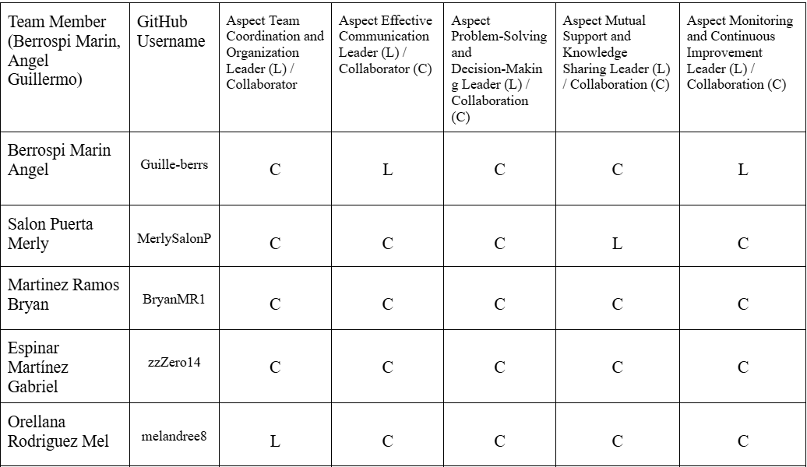

# Informe del Trabajo Final

## Universidad Peruana de Ciencias Aplicadas
### Ingeniería de Software 💻
### Séptimo Ciclo
### Curso: Aplicaciones Web (1ASI0730)
### NRC: 7461
### Docente: Ángel Augusto Velásquez Núñez
### Startup: SmartCoders
### Producto: MoveSys

* Integrantes

    * Bryan Felix Martinez Ramos 202316246
    * Merly Salon Puerta U20201b772
    * Gabriel Ferran Espinar Martínez U202310436
    * Angel Guillermo Berrospi Marin U202114701
    * Orellana Rodriguez Mel Andree U202116018

### Septiembre 2025

# **Registro de Versiones del Informe**

| Versión | Fecha | Autor | Descripción de modificación |
|-----------|-----------|-----------|-----------|
|-----------|-----------|-----------|-----------|
|-----------|-----------|-----------|-----------|

# **Project Report Collaboration Insights**

URL Project Report (Github): [https://github.com/1ASI0730-2510-4370-G2-Youper/Report](https://github.com/1ASI0730-2510-4370-G2-Youper/Report)

## Contenido

- [✨ Informe Trabajo Final ✨](#-informe-trabajo-final-)
    - [Universidad Peruana de Ciencias Aplicadas 🎓](#universidad-peruana-de-ciencias-aplicadas-)
    - [Registro de versiones del Informe](#registro-de-versiones-del-informe)
    - [Project Report Collaboration Insights](#project-report-collaboration-insights)
    - [Contenido](#contenido)
    - [Student Outcome](#student-outcome)
- [Capítulo I: Introducción](#capítulo-i-introducción)
    - [1.1. Startup Profile](#11-startup-profile)
    - [1.1.1. Descripción de la Startup](#111-descripción-de-la-startup)
    - [1.1.2 Perfiles de integrantes del equipo](#112-perfiles-de-integrantes-del-equipo)
    - [1.2. Solution Profile](#12-solution-profile)
    - [1.2.1 Antecedentes y problemática](#121-antecedentes-y-problemática)
    - [1.2.2 Lean Ux Process](#122-lean-ux-process)
    - [1.2.2.1. Lean UX Problem Statements](#1221-lean-ux-problem-statements)
    - [1.2.2.2. Lean UX Assumptions](#1222-lean-ux-assumptions)
    - [1.2.2.3. Lean UX Hypothesis Statements](#1223-lean-ux-hypothesis-statements)
    - [1.2.2.4. Lean UX Canvas](#1224-lean-ux-canvas)
    - [Segmentos Objetivos](#segmentos-objetivos)
- [Capítulo II: Requeriments Elicitation \& Analysis](#capítulo-ii-requeriments-elicitation--analysis)
    - [2.1. Competidores](#21-competidores)
    - [2.1.1. Análisis competitivo](#211-análisis-competitivo)
    - [2.1.2. Estrategias y tácticas frente a competidores](#212-estrategias-y-tácticas-frente-a-competidores)
    - [2.2. Entrevistas 📝](#22-entrevistas-)
    - [2.2.1. Diseño de entrevistas](#221-diseño-de-entrevistas)
    - [2.2.2. Registro de entrevistas](#222-registro-de-entrevistas)
    - [2.2.3. Análisis de entrevistas](#223-análisis-de-entrevistas)
    - [2.3. Needfinding](#23-needfinding)
    - [2.3.1. User Personas](#231-user-personas)
    - [2.3.2. User Task Matrix](#232-user-task-matrix)
    - [2.3.3. User Journey Mapping](#233-user-journey-mapping)
    - [2.3.4. Empathy Mapping](#234-empathy-mapping)
    - [2.4. Big Picture EventStorming](#24-big-picture-evenstorming)
    - [2.5. Ubiquitous Language](#25-ubiquitous-language)
- [Capítulo III: Requeriments Specification](#capítulo-iii-requeriments-specification)
    - [3.1. User Stories](#31-user-stories)
    - [3.2. Impact Mapping](#32-impact-mapping)
    - [3.3. Product Backlog](#33-product-backlog)
- [Capítulo IV: Product Desing](#capítulo-iv-product-desing)
    - [4.1. Style Guidelines](#41-style-guidelines)
    - [4.1.1. General Style Guidelines](#411-general-style-guidelines)
    - [4.1.2. Web Style Guidelines](#412-web-style-guidelines)
    - [4.2. Information Architecture](#42-information-architecture)
    - [4.2.1. Organization Systems](#421-organization-systems)
    - [4.2.2. Labeling Systems](#422-labeling-systems)
    - [4.2.3. SEO Tags and Meta Tags](#423-seo-tags-and-meta-tags)
    - [4.2.4. Searching Systems](#424-searching-systems)
    - [4.2.5. Navigation Systems](#425-navigation-systems)
    - [4.3. Landing Page UI Desing](#43-landing-page-ui-desing)
    - [4.3.1. Landing Page Wireframes](#431-landing-page-wireframes)
    - [4.3.2. Landing Page Mock-Up](#432-landing-page-mock-up)
    - [4.4. Web Applications UX/UI Desing](#44-web-applications-uxui-desing)
    - [4.4.1. Web Applications Wireframes](#441-web-applications-wireframes)
    - [4.4.2. Web Applications Wireflow Diagrams](#442-web-applications-wireflow-diagrams)
    -[4.4.3. Web Applications Mock-ups](#443-web-applications-mock-ups-diagrams)
    - [4.4.4. Web Applications User Flow Diagrams](#444-web-applications-user-flow-diagrams)
    - [4.5. Web Applications Prototyping](#45-web-applications-prototyping)
    - [4.6.1. Design-Level EventStorming](#461-design-level-eventstorming)
    - [4.6.2. Software Architecture Context Diagram](#462-software-architecture-context-diagram)
    - [4.6.3. Software Architecture Container Diagram](#463-software-architecture-container-diagram)
    - [4.6.4. Software Architecture Components Diagram](#464-software-architecture-components-diagram)
    - [4.7. Software Object-Oriented Desing](#47-software-object-oriented-desing)
    - [4.7.1. Class Diagram](#471-class-diagram)
    - [4.8. Database Desing](#48-database-desing)
    - [4.8.1. Database Diagrams](#481-database-diagrams)
- [Capítulo V: Product Implementation, Validation \& Deployment](#capítulo-v-product-implementation-validation--deployment)
    - [5.1. Software Configuration Management](#51-software-configuration-management)
    - [5.1.1. Software Development Environment Configuration](#511-software-development-environment-configuration)
    - [5.1.2. Source Code Management](#512-source-code-management)
    - [5.1.3. Source Code Style Guide \& Conventions](#513-source-code-style-guide--conventions)
    - [5.1.4. Software Deployment Configuration](#514-software-deployment-configuration)
    - [5.2. Landing Page, Service \& Applications Implementation](#52-landing-page-service--applications-implementation)
    - [5.2.1. Sprint](#52x-sprint)
    -  [5.2.1.1. Sprint Planning 1](#5211-Sprint-Planning1)
    -  [5.2.1.2. Aspect Leaders and Collaborators](#5212-Aspect-Leaders-and-Collaborators)
    -  [5.2.1.3. Sprint Backlog 1](#5213-Sprint-Backlog-1)
    -  [5.2.1.4. Development Evidence for Sprint Review](#5214-Development-Evidence-for-Sprint-Review)
    -  [5.2.1.5. Execution Evidence for Sprint Review](#5215-Execution-Evidence-for-Sprint-Review)
    -  [5.2.1.6. Services Documentation Evidence for Sprint Review](#5216-Services-Documentation-Evidence-for-Sprint-Review)
    -  [5.2.1.7. Software Deployment Evidence for Sprint Review](#5217-Software-Deployment-Evidence-for-Sprint-Review)
    -  [5.2.1.8. Team Collaboration Insights during Sprint](#5218-Team-Collaboration-Insights-during-Sprint)
    -  [Conclusiones](#Conclusiones)
    -  [Bibliografía](#Bibliografía)
    -  [Anexos](#Anexos)

# **Student Outcome**

**ABET – EAC - Student Outcome 5**
Criterio: La capacidad de funcionar efectivamente en un equipo cuyos miembros juntos proporcionan liderazgo, crean un entorno de colaboración e inclusivo, establecen objetivos, planifican tareas y cumplen objetivos. 
En el siguiente cuadro se describe las acciones realizadas y enunciados de conclusiones por parte del grupo, que permiten sustentar el haber alcanzado el logro del ABET – EAC - Student Outcome 5. 

| Criterio específico | Acciones realizadas | Conclusiones |
| ------------------- | ------------------- | ------------ |
| ------------------- | ------------------- | ------------ |
| ------------------- | ------------------- | ------------ |

# Capítulo 1: Introducción

## 1.1. Startup Profile

### 1.1.1. Descripción de la Startup

### 1.1.2. Perfiles de integrantes del equipo

| **Integrante**            | **Angel Guillermo** |
|---------------------------|---------------------------------------------------------------------------------------------------|
| **Código del Estudiante** |                   |
| **Carrera**               | Ingeniería de Software             |
| **Descripción**           |   |
| Foto                      |  |

| **Integrante**            | **Mel Andre**                                             |
|---------------------------|---------------------------------------------------------------------------------------------------|
| **Código del Estudiante** |                                    |
| **Carrera**               | Ingeniería de                                                                     |
| **Descripción**           |        |
| Foto                      |        |

| **Integrante**            | **Gabriel**                                             |
|---------------------------|---------------------------------------------------------------------------------------------------|
| **Código del Estudiante** |                                    |
| **Carrera**               | Ingeniería de                                                                     |
| **Descripción**           |        |
| Foto                      |        |

| **Integrante**            | **Bryan**                                             |
|---------------------------|---------------------------------------------------------------------------------------------------|
| **Código del Estudiante** |                                    |
| **Carrera**               | Ingeniería de                                                                     |
| **Descripción**           |        |
| Foto                      |        |

| **Integrante**            | **Merly**  |
|---------------------------|---------------------------------------------------------------------------------------------------|
| **Código del Estudiante** |                                    |
| **Carrera**               | Ingeniería de                      |
| **Descripción**           |                                    |
| Foto                      |                                    |

## 1.2. Solution Profile
    
### 1.2.1 Antecedentes y problemática

    
### 1.2.2 Lean UX Process.
    
### 1.2.2.1. Lean UX Problem Statements.

### 1.2.2.2. Lean UX Assumptions.

### 1.2.2.3. Lean UX Hypothesis Statements.
    
### 1.2.2.4. Lean UX Canvas.
    

## 1.3. Segmentos objetivo.
    
# Capítulo II: Requirements Elicitation & Analysis
    
## 2.1. Competidores.
    
### 2.1.1. Análisis competitivo.
    
### 2.1.2. Estrategias y tácticas frente a competidores.
    
## 2.2. Entrevistas.
    
### 2.2.1. Diseño de entrevistas.
    
### 2.2.2. Registro de entrevistas.
    
### 2.2.3. Análisis de entrevistas.
    
## 2.3. Needfinding.
    
### 2.3.1. User Personas.
    
### 2.3.2. User Task Matrix.

### 2.3.3. User Journey Mapping.

### 2.3.4. Empathy Mapping.
    
## 2.4. Big Picture EventStorming.
    
## 2.5. Ubiquitous Language.
    
# Capítulo III: Requirements Specification
  
## 3.1. User Stories.
   
## 3.2. Impact Mapping.
    
## 3.3. Product Backlog.
    
# Capítulo IV: Product Design
   
## 4.1. Style Guidelines.
   
### 4.1.1. General Style Guidelines.
    
### 4.1.2. Web Style Guidelines.
    
## 4.2. Information Architecture.
    
### 4.2.1. Organization Systems.
    
### 4.2.2. Labeling Systems.
    
### 4.2.3. SEO Tags and Meta Tags
    
### 4.2.4. Searching Systems.
    
### 4.2.5. Navigation Systems.
    
## 4.3. Landing Page UI Design.
    
### 4.3.1. Landing Page Wireframe.
    
### 4.3.2. Landing Page Mock-up.
    
## 4.4. Web Applications UX/UI Design.
    
### 4.4.1. Web Applications Wireframes.
    
### 4.4.2. Web Applications Wireflow Diagrams.
    
### 4.4.2. Web Applications Mock-ups.
    
### 4.4.3. Web Applications User Flow Diagrams.
    
## 4.5. Web Applications Prototyping.
   
## 4.6. Domain-Driven Software Architecture.
    
### 4.6.1. Design-Level EventStorming.
    
### 4.6.2. Software Architecture Context Diagram.
    
### 4.6.3. Software Architecture Container Diagrams.
    
### 4.6.4. Software Architecture Components Diagrams.
    
## 4.7. Software Object-Oriented Design.
    
### 4.7.1. Class Diagrams.
    
## 4.8. Database Design.
    
### 4.8.1. Database Diagrams.
    
# Capítulo V: Product Implementation, Validation & Deployment
    
## 5.1. Software Configuration Management.
    
### 5.1.1. Software Development Environment Configuration.
    
### 5.1.2. Source Code Management.
    
### 5.1.3. Source Code Style Guide & Conventions.
    
### 5.1.4. Software Deployment Configuration.
    
## 5.2. Landing Page, Services & Applications Implementation.
    
## 5.2.1. Sprint n
    
### 5.2.1.1. Sprint Planning n.
    
En esta sección se especifica los aspectos principales del Sprint Planning Meeting.

<table>
<tr>
    <th colspan="5">Sprint </th>
    <th colspan="9">Sprint 1</th>
  </tr>
      <tr>
    <td colspan="13">Sprint Planning Background</td>
  </tr>
  <tr>
    <td colspan="5">Date</td>
    <td colspan="8">2025-09-15</td>
</tr>
  <tr>
    <td colspan="5">Time</td>
    <td colspan="8">4:00PM</td>
  </tr>
  <tr>
    <td colspan="5">Location</td>
    <td colspan="8">Servidor de Discord del equipo</td>
<tr>
    <td colspan="5">Prepared By</td>
    <td colspan="8">Andre Orellana</td>
</tr>
<tr>
    <td colspan="5">Attendees (to planning meeting)</td>
    <td colspan="8"> Merly Salon,Gabriel Espinar, Andre Rodriguez Orellana, Angel Berrospi Marin, Brayan Martinez</td>
</tr>
<tr>
    <td colspan="5">Sprint  1 Review Summary</td>
    <td colspan="8">En esta segunda sección se planteó el mejormiento del desarrollo y estructura de la Landing page antes de subirse al repositorio.</td>
</tr>
<tr>
    <td colspan="5">Sprint 1 Retrospective Summary</td>
    <td colspan="8">En esta sesión todos los participantes, opinaron, mejoraron sus habilidades y cada uno se encargó de las mejoras dadas en la retroalimentación, también en el desarrollo de la landing y finalmente se decidió subir el landing en el último día</td>
</tr>
<tr>
    <td colspan="13">Sprint Goal & User Stories</td>
</tr>
<tr>
    <td colspan="5">Sprint 1 Goal</td>
    <td colspan="8"> La meta de este Sprint 1 es la mejora tanto en planteamiento y desarrollo de la documentación y que nuestra Landing Page tenga una correcta funcionalidad para el usuario de forma amigable.  

</td>
</tr>
<tr>
    <td colspan="5">Sprint 1 Velocity</td>
    <td colspan="8">velocity 6</td> 
</tr>
<tr>
    <td colspan="5">Sum of Story Points</td>
    <td colspan="8">8 story points</td>
</tr>
</table>

### 5.2.1.2. Aspect Leaders and Collaborators.
    

### 5.2.1.3. Sprint Backlog n.
    

### 5.2.1.4. Development Evidence for Sprint Review.
| Repository                                      | Branch                                          | Commit Id                                   | Commit Message                                           | Commit Message Body                                                                                                                                                 | Committed on (Day) |
|-------------------------------------------------|-------------------------------------------------|---------------------------------------------|----------------------------------------------------------|--------------------------------------------------------------------------------------------------------------------------------------------------------------------|-------------------|
| Guille-berrs/movesys-project-report-            | feature/startup-profile                         | 751c06f                                      | docs: Add chapter one                                    | - Startup Profile - Description Profile - My profile in team members - My photo to assets folder                                                           | 17/09/2025        |
| Guille-berrs/movesys-project-report-            | feature/solution-profile                        | f38da45                                      | docs: Chapter one SolutionProfile                        | - Background and Problems - Lean Ux Process                                                                                                                      | 17/09/2025        |
| Guille-berrs/movesys-project-report-            | feature/software-object-oriented-design         | d300700                                      | docs: Add chapter four Software Object-Oriented Design   | - Class Diagram - Aggregate picture in file assets about Class Diagram                                                                                            | 17/09/2025        |
| Guille-berrs/movesys-project-report-            | feature/domain-driven-software-architecture     | e5eda47                                      | docs: Add chapter four                                   | - Domain-Driven Software Architecture - Aggregate pictures in file assets about Domain-Driven Software Architecture                                              | 17/09/2025        |
| Guille-berrs/movesys-project-report-            | feature/database-design                         | f50288c                                      | docs: Add chapter four Database Design                   | - Aggregate picture in Database Diagrams - Aggregate picture in file assets about Database Diagrams                                                              | 17/09/2025        |
| movesys-project-report-                         | feature/startup-profile                         | 1c7a0c6                                      | docs: add member information for Team member profiles    | none                                                                                                                                                               | 17/09/2025        |
| movesys-project-report-                         | feature/startup-profile                         | 1c7a0c6                                      | docs: add member information for Team member profiles    | none                                                                                                                                                               | 17/09/2025        |
| movesys-project-report-                         | feature/startup-profile                         | 1c7a0c6                                      | docs: add member information for Team member profiles    | none                                                                                                                                                               | 17/09/2025        |
| movesys-project-report-                         | feature/startup-profile                         | 1c7a0c6                                      | docs: add member information for Team member profiles    | none                                                                                                                                                               | 17/09/2025        |
| movesys-project-report-                         | feature/startup-profile                         | 1c7a0c6                                      | docs: add member information for Team member profiles    | none                                                                                                                                                               | 17/09/2025        |
| movesys-project-report-                         | feature/startup-profile                         | 1c7a0c6                                      | docs: add member information for Team member profiles    | none                                                                                                                                                               | 17/09/2025        |
| merlysalon23/movesys-project-report-            | feature/web-aplication-ux/ui design             | 2f377f5e351010ee09baa4b59c98cdb8e396a2f8     | docs: added mock-ups                                    | none                                                                                                                                                               | 17/09/2025        |
| merlysalon23/movesys-project-report-            | feature/web-aplication-ux/ui design             | 41a0ef133a4675a28b7d9ee70aa8d8dff233fb37     | docs: added web app wireflow                             | none                                                                                                                                                               | 17/09/2025        |
| merlysalon23/landing-page                       | feature/footer                                  | c466647b58490b60cdb9a9e05889cc720a2ec16c     | feat(footer): add footer style.                         | none                                                                                                                                                               | 17/09/2025        |

### 5.2.1.5. Execution Evidence for Sprint Review.
    

### 5.2.1.6. Services Documentation Evidence for Sprint Review.
    

    
### 5.2.1.7. Software Deployment Evidence for Sprint Review.
    

### 5.2.1.8. Team Collaboration Insights during Sprint.

## Conclusiones

## Bibliografía

## Anexos
